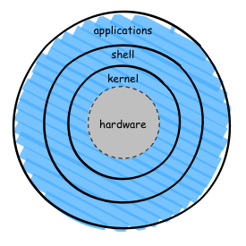

# Day 02 – Linux Architecture, Processes, and systemd

## Architecture of Linux:
The Linux architecture defines how different components of the system interact with each other to manage hardware resources, run applications, and provide a stable and secure computing environment. Linux follows a layered architecture, where each layer has a specific role and responsibility.

## Core components of Linux Architecture:
- **Kernel:**
    - **Kernel** is the core component of the Linux operating system that sits between the hardware and user space, managing system resources and ensuring smooth communication between software and hardware.
    - It controls how processes are executed, scheduled, and isolated to maintain system stability and security.
    - The kernel is responsible for:
        - **Memory management –** Allocates and manages system memory efficiently
        - **Process management –** Schedules processes and controls execution using queues
        - **Resource allocation –** Distributes CPU, memory, and I/O resources among processes
        - **Device management –** Controls hardware devices through device drivers
        - **Application interaction –** Acts as a bridge between applications and hardware
        - **Security –** Enforces access control and system-level security mechanisms

- **User Space (Shell & User Application):**
    - The topmost layer where users interact via Command Line Interface (CLI) or Graphical User Interface (GUI), including applications like web browsers and terminal utilities.
    - Applications interact with the kernel using **system calls**.

- **Init / systemd:**
    - The **init** system is the first user-space process started by the kernel during boot, usually with Process ID (**PID 1**).
    - In most modern Linux distributions use **systemd** as their default init system.
    - It initializes the system, starts and manages services (daemons) using utility commands like systemctl , handles dependencies, monitors background processes, and manages logging and system resources.
    - Systemd also speeds up boot times by starting services in parallel.

## How processes are created and managed

### Process creation: 
- A process is created when a user starts a program, during system initialization, or when an existing process creates a new process.
- A process starts using `fork()` and child process may load a new program using `exec()`

### Process Management:
- Kernel assigns a unique **Process ID (PID), Parent PID,** and allocates memory, CPU time, and other required resources.
- Throughout its lifecycle, a process moves through several distinct structural states:
    - **Running (R)** → Actively using CPU.
    - **Sleeping (S)** → Waiting for event (I/O, resource).
    - **Stopped (T)** → Suspended (e.g., via `Ctrl+Z`).
    - **Zombie (Z)** → Finished execution but not yet cleaned up by parent.
    - **Idle (D)** → Kernel threads waiting for work.
- Linux controls processes using signals, common signals:
    - `SIGTERM` → Graceful stop
    - `SIGKILL` → Force stop
    - `SIGSTOP` → Pause process

## What systemd does in Linux and why it matters

### Main functions of systemd:
- **Boot Management:** Starts the operating system and loads required services during startup.
- **Service Management:** Controls system services (daemons) such as web servers, databases, and networking using commands like `systemctl start` or `systemctl stop`.
- **Dependency Handling:** Ensures services start in the correct order based on dependencies.
- **Parallel Startup:** Starts multiple services simultaneously to reduce boot time.
- **Logging:** Provides centralized logging through `journald`.
- **Resource Control:** Uses Linux control groups (cgroups) to track and manage processes efficiently.
- **User and Session Management:** Handles user logins, sessions, and runtime services.

### systemd matters:
systemd is important because it makes Linux systems:
- **Faster** – parallel service startup improves boot speed.
- **More Reliable** – automatic service monitoring and restart features improve stability.
- **Easier to Manage** – administrators can control services with simple commands.
- **More Organized** – centralized management replaces many older scripts and tools.

## 5 Commands used daily 
- `ps aux` → View running processes.
- `top` / `htop` → Monitor CPU/memory usage.
- `systemctl status <service>` → Check service health.
- `journalctl -u <service>` → View logs for a service.
- `kill -9 <PID>` → Terminate misbehaving process.

## 👉 Takeaway: 
- Understanding kernel, processes, and systemd is the foundation of Linux troubleshooting. 
- As a DevOps engineer, these are the tools and concepts you’ll use daily to keep systems healthy and responsive.
