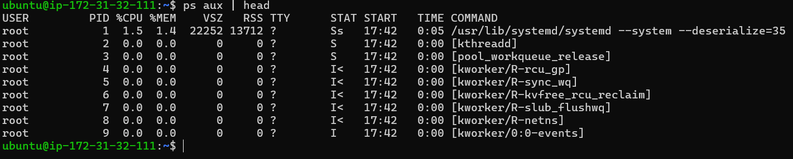
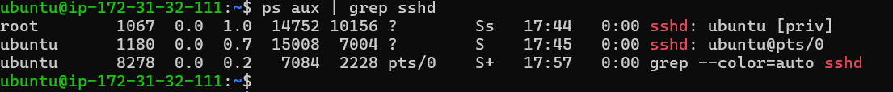
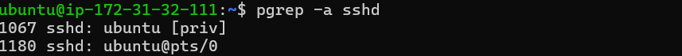
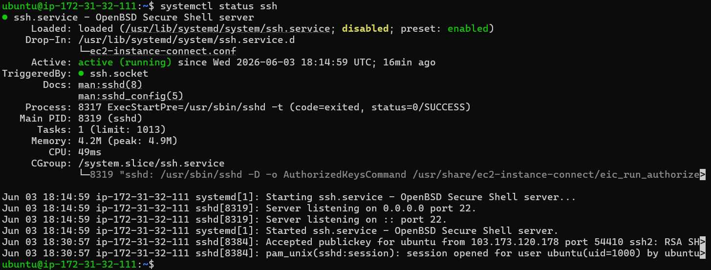
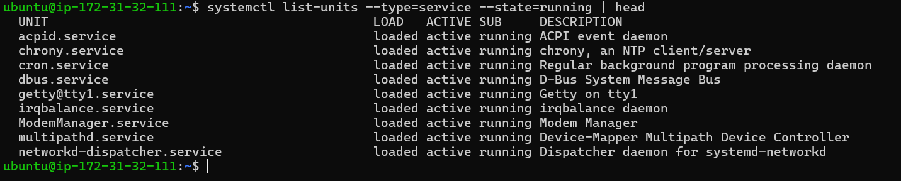
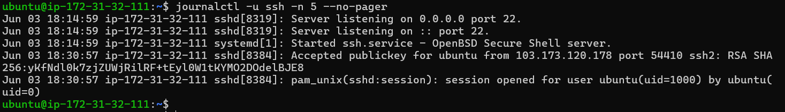
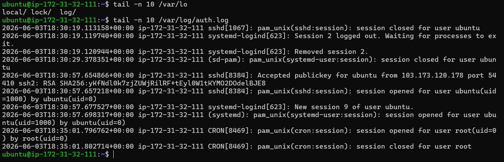

# Day 04 – Linux Practice: Processes and Services

**Goal:** Learn how to check running processes, inspect system services, view logs, and perform basic troubleshooting on a Linux server.

---

## 1. Process Checks
Monitoring running processes helps ensure your applications are alive and consuming the right amount of resources.

**Command 1:** `ps aux | head`

**Purpose:**
- Used to view the top few lines of your system's currently running processes.
- The `ps` (process status) command snapshot reveals what is currently running on your system.
- **`a`**: Shows processes for all users, not just the current user.
- **`u`**: Displays the output in a user-oriented format (includes detailed columns like username, CPU %, and Memory %).
- **`x`**: Lists processes that do not have a controlling terminal (like background system daemons/services).
- **`|` (Pipe)**: Takes the massive list generated by `ps aux` and redirects it as input into the next command.
- **`head`**: By default, catches that input and prints **only the first 10 lines**.
- If you want to see a specific number of lines instead of the default 10, pass the number flag to head. For example, to see just the headers and the top 3 processes, run:  ps aux | head -n 4

**Output:**

**Command 2:** `ps aux | grep ssh`

**Purpose:**

- To see detailed information about the running SSH daemon processes.
- Its purpose is to search through all active system processes and grep ssh filter out lines that mention "**ssh**".

**Output:**

**Command 3:** `pgrep -a sshd` 

**Purpose:**

- Used to search for currently running `sshd` (SSH daemon) processes and display both their Process IDs (PIDs) and their full command-line arguments.
- **`pgrep`**: Stands for "Process Grep". It looks through the currently running processes on the system and lists the PIDs of those that match your search criteria.
- **`a`**: This flag tells the command to output the **full command line** along with the process ID. Without `a`, `pgrep` will only output a list of numbers (PIDs), which doesn't give you any context.
- **`sshd`**: This is the search pattern. It tells `pgrep` to look for processes with names containing "sshd".

**Output:**

---

## 2. Service Checks

Systemd manages the lifecycle of background services in modern Linux distributions.

**Command 4:** `systemctl status ssh`

**Purpose:**

- To check the current state (active, inactive, failed) of the SSH service.

**Output:**

**Command 5:** `systemctl list-units --type=service --state=running | head`

**Purpose:**

- Shows all background applications and currently running services
- If you want to view the entire list of running services without it cutting off at 10 lines, but you still want to prevent it from flooding your terminal screen, remove `| head` and use `--no-pager` .

**Output:**

---

## 3. Log Checks

When things go wrong, logs are your best friend. Linux stores central logs via `journald` and traditional text files.

**Command 6:** `journalctl -u ssh -n 5 --no-pager`

**Purpose:**

- Inspects the systemd journal specifically for the `ssh` unit, limiting the output to the last 5 lines.

**Output:**

**Command 7:** `sudo tail -n 10 /var/log/auth.log`

**Purpose:**

- Views the tail end of the dedicated authentication log file to monitor login attempts (SSH login attempts, failed connections, security monitoring).

**Output:**

---

## 4. Mini Troubleshooting Steps

Imagine your team reports they cannot SSH into a newly provisioned server. Here is your quick, standard DevOps triage flow:

1. **Is the process even running?**
    - Run `pgrep -l sshd`
    - If no PID is returned, the application has stopped.
2. **Check the systemd state:**
    - Run `systemctl status ssh`
    - Look for `Active: failed` or `Active: inactive`
    - If it's stopped, try starting it with `sudo systemctl start ssh`
3. **Verify the systemd state and confirm the port is listening:**
    - Run `systemctl status ssh`
    - Confirm the port is listening `ss -tlnp | grep :22`  or `netstat -tlnp | grep :22`
4. **Investigate the root cause via logs:**
    - If it failed to start, run `journalctl -u ssh -n 50 --no-pager`
    - Look for syntax errors in configuration files (e.g., `/etc/ssh/sshd_config`) or port conflicts (e.g., `Bind to port 22 failed - Address already in use`)

---

## Few more commands and variations in it:

- `ps` → Show current terminal processes
- `ps -a` → Show all terminal processes
- `ps aux` → Detailed process list
- `ps aux --sort=-%cpu | head -n 5` → Top CPU processes
- `ps aux --sort=-%mem | head -n 5` → Top memory processes
- `ps -C sshd` → Exact process match
- `pgrep -l sshd` → list the long name of the process alongside its Process ID (PID)
- `top` ****→ ****Real-time Monitoring
- `top -bn1 | head -20` → Grab a single, static snapshot of system's resource usage (CPU, Memory, Load Average) and display the top 20 lines
- `systemctl is-active ssh` → Script-friendly command to quickly return the status
- `journalctl -xe` → Detailed errors
- `journalctl -u ssh --since "1 hour ago"` → Time-based logs
- `tail -f /var/log/syslog` → view system log messages in real-time as they are actively being written.

---

## 👉 **Takeaway:** 

- Processes → what is running
- Services → what should be running
- Logs → what actually happened
- `ps` and `pgrep` help inspect running processes.
- `systemctl` is used to manage and inspect systemd services.
- `journalctl` helps investigate service-related issues.
- Logs are often the first place to look during troubleshooting.
- `/var/log/auth.log` → security & login activity
- `/var/log/syslog`  → general system log file which stores system messages generated by the kernel, system services, daemons, and applications.