# Day 05 – Linux Troubleshooting Drill: CPU, Memory, and Logs

**Goal:** The goal is not just running commands but building a repeatable troubleshooting workflow that can be used during real incidents.

## Target Service / Process Used During Drill

- **Service:** Docker
- **Reason:** Docker is a critical runtime service used for running containers and application workloads.

---

## Environment Basics

### 1. OS Information 

```bash
uname -a
```

**Output:**

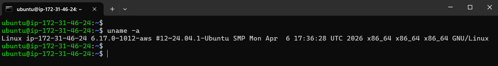

**Observation:**
- System is running Ubuntu Linux kernel 6.17
- No immediate kernel-related concerns observed.

### 2. Distribution Information

```bash
cat /etc/os-release
```

**Output:**

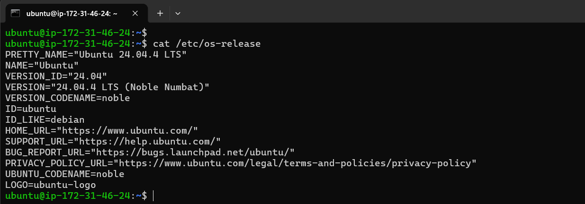

**Observation:**
- Host OS is Ubuntu 24.04 LTS.
- Useful when verifying package compatibility and troubleshooting known OS issues.

---

## Filesystem Sanity Checks

### 3. Create Temporary Working Directory

```bash
mkdir -p /tmp/runbook-demo
```

**Output:**

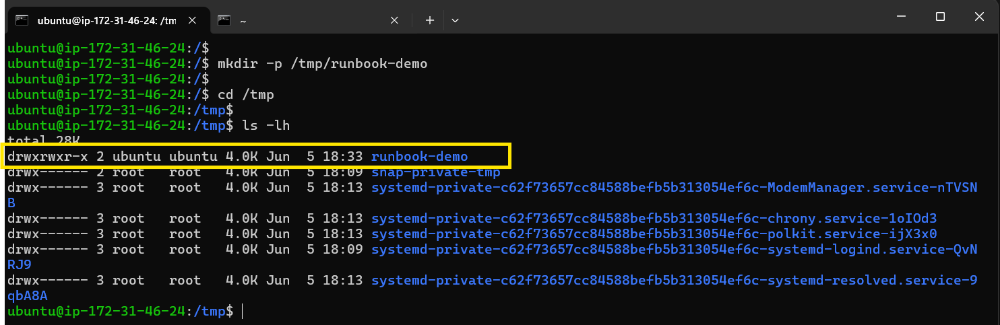

**Observation:**
- Temporary troubleshooting directory created successfully.
- Confirms write access to filesystem.

### 4. Copy and Verify File

```bash
cp /etc/hosts /tmp/runbook-demo/hosts-copy && ls -l /tmp/runbook-demo
```

**Output:**

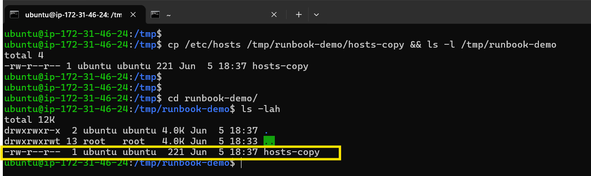

**Observation:**
- File copy operation completed successfully.
- No filesystem permission issues detected.

---

## Snapshot: CPU & Memory

### 5. Inspect Docker Process Usage

```bash
ps -o pid,pcpu,pmem,comm -C dockerd
```

**Output:**

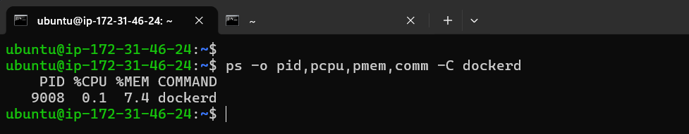

**Observation:**
- Docker daemon consuming minimal CPU.
- Memory usage appears healthy.

### 6. Memory Status

```bash
free -h
```

**Output:**

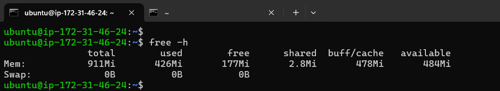

**Observation:**
- Healthy memory availability.
- Swap is not being utilized.

---

## Snapshot: Disk & IO

### 7. Filesystem Capacity

```bash
df -h
```

**Output:**

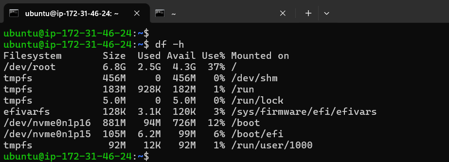

**Observation:**
- Root filesystem below 50% utilization.
- No immediate disk-space concern.

### 8. Log Directory Usage

```bash
du -sh /var/log
```

**Output:**

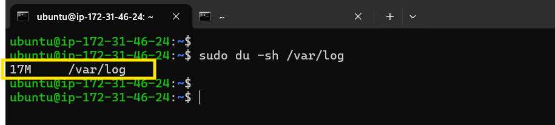

**Observation:**
- Log directory size is reasonable.
- No abnormal log growth detected.

### 9. Virtual Memory Statistics

```bash
vmstat 1 5
```

**Output:**

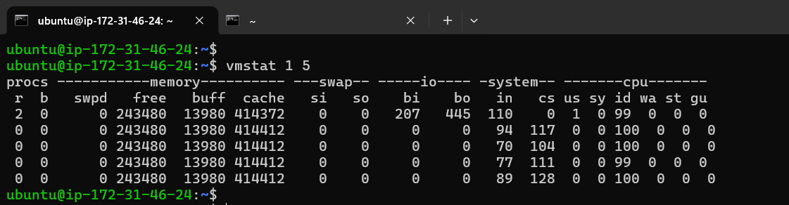

**Observation:**
- No CPU wait state issues.
- No swapping activity observed.

---

## Snapshot: Network

### 10. Listening Ports

```bash
ss -tulpn | grep docker
```

**Output:**

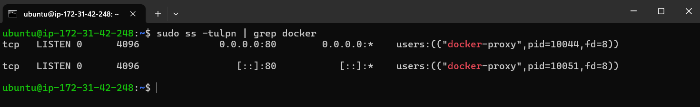

**Observation:**
- Docker service is listening on expected port.
- Service is reachable locally.

### 11. Service Reachability

```bash
curl -I http://localhost:2375
```

**Output:**

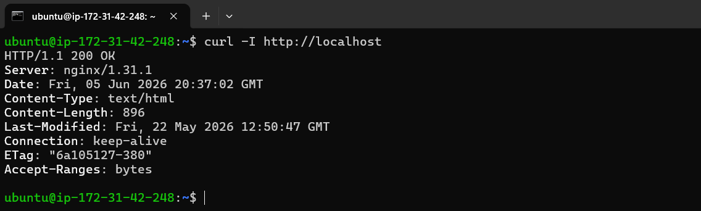

**Observation:**
- Local service endpoint responding successfully.
- No immediate connectivity issues.

---

## Logs Reviewed

### 12. Docker Service Logs

```bash
journalctl -u docker -n 50 --no-pager
```

**Output:**

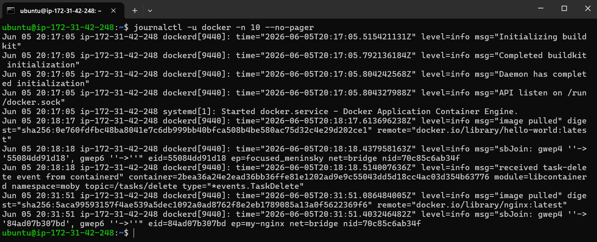

**Observation:**
- No critical errors in recent logs.
- Docker service appears healthy.

### 13. System Log Review

```bash
tail -n 50 /var/log/syslog
```

**Output:**

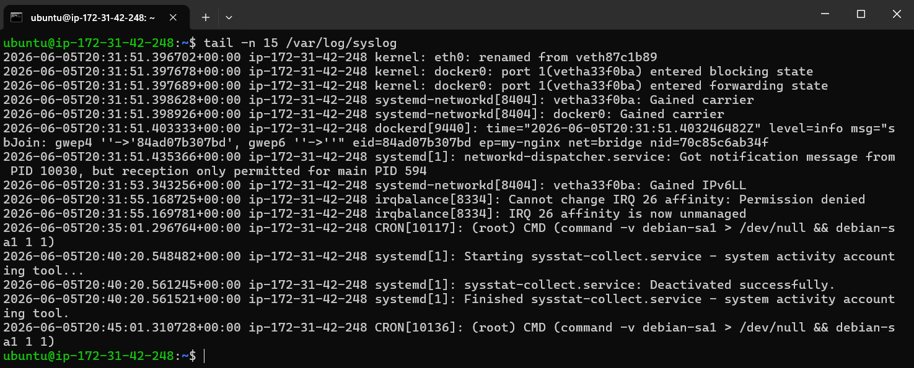

**Observation:**
- No kernel-level or Docker-related warnings.
- System operating normally.

---

## Quick Findings

- Docker daemon is running normally.
- CPU and memory utilization are low.
- Disk usage is within acceptable limits.
- Network endpoint is responding.
- Recent logs show no critical errors.
- No evidence of resource exhaustion or service instability.

---

## If This Worsens

### 1. Service Recovery

Check service state and restart if required.

```bash
systemctl status docker
systemctl restart docker
```

**Purpose:**
- Recover from transient daemon issues.
- Validate successful restart.

### 2. Increase Troubleshooting Depth

Collect process-level diagnostics.

```bash
strace -p <PID>
lsof -p <PID>
```

**Purpose:**
- Identify blocked system calls.
- Detect file/socket issues.

### 3. Collect Extended Diagnostics

Capture resource trends and detailed logs.

```bash
docker info
docker ps -a
journalctl -u docker --since "1 hour ago"
```

**Purpose:**
- Gather evidence before escalation.
- Analyze container failures and daemon events.

---

## Conclusion:

A complete health snapshot was collected covering:
- Environment validation
- Filesystem checks
- CPU & memory utilization
- Disk & IO status
- Network connectivity
- Service log analysis

Current status: Docker service is healthy and operational.

---

## 👉 Takeaway:

A strong troubleshooting flow usually follows:
1. Confirm service status
2. Check CPU/Memory 
3. Check Disk/IO 
4. Check Network connectivity 
5. Review Logs 
6. Correlate findings 
7. Mitigate
8. Collect deeper diagnostics

This sequence mirrors how experienced DevOps and SRE engineers approach production incidents under time pressure.