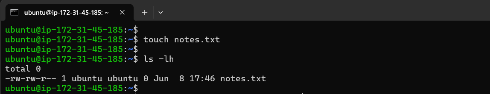
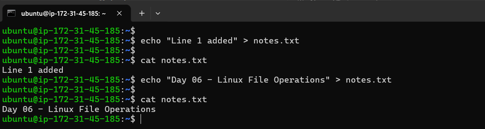
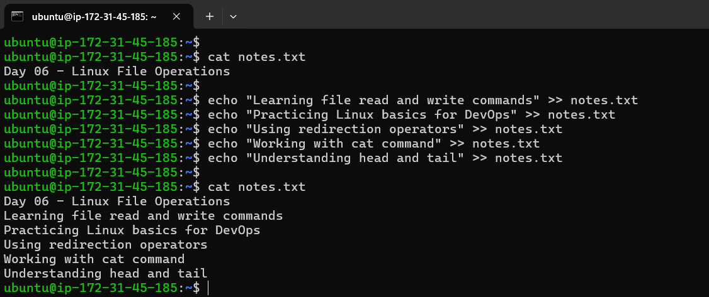
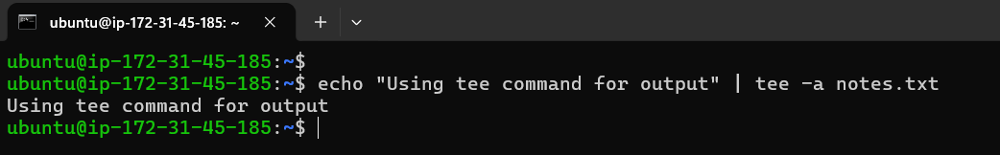
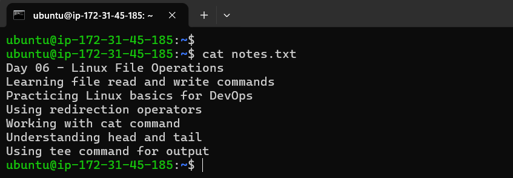
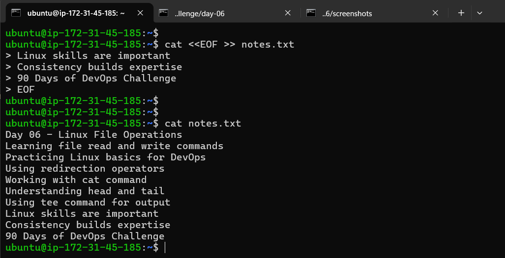
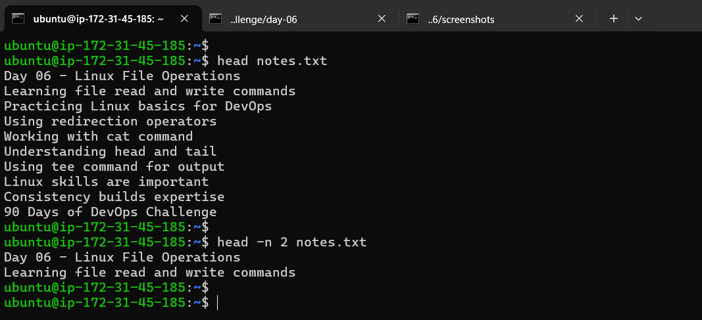
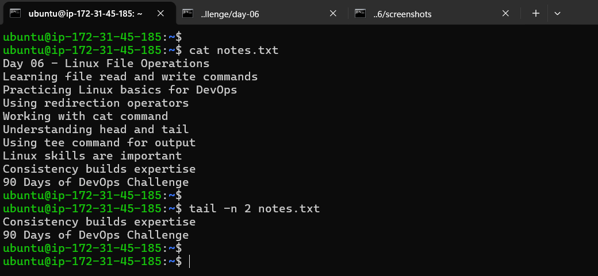

# Day 06 – Linux Fundamentals: Read and Write Text Files
**Goal:** Practice basic file read/write using only fundamental commands.

## Step 1: Create the file

```bash
touch notes.txt
```

**Output:**



**Observation:**

- Creates an empty file name notes.txt

---

## Step 2: Write the first line (`>`)

```bash
echo "Line 1 added" > notes.txt
echo "Day 06 - Linux File Operations" > notes.txt
```

**Output:**



**Observation:**

- `>` creates a new file or overwrites existing content.
- content “Line 1 added” overwrites with content "Day 06 - Linux File Operations"content”

---

## Step 3: Append additional lines (`>>`)

```bash
echo "Learning file read and write commands" >> notes.txt
echo "Practicing Linux basics for DevOps" >> notes.txt
echo "Using redirection operators" >> notes.txt
echo "Working with cat command" >> notes.txt
echo "Understanding head and tail" >> notes.txt
```

**Output:**



**Observation:**

- `>>` adds content to the new line without removing existing data.

---

## Step 4: Use `tee` to write and display simultaneously

```bash
echo "Using tee command for output" | tee -a notes.txt
```

**Output:**



**Observation:**

- `tee` displays output on the terminal
- `a` appends the output to the file

---

## Step 5: Read the complete file

```bash
cat notes.txt
```

**Output:**



**Observation:**

- Displays the full content of the file.

---

## Step 6: Add Multiple Lines Using EOF

```bash

cat <<EOF >> notes.txt
Linux skills are important
Consistency builds expertise
90 Days of DevOps Challenge
EOF
```

**Output:**



**Observation:**

- `EOF` is a multi-line input method
- Appends multiple lines at once

## Step 7: Read starting lines of file

```bash
head notes.txt
```

```bash
head -n 2 notes.txt
```

**Output:**



**Observation:**

- Shows the first 10 lines by default
- `n` specifies number of lines

---

## Step 8: Read last 2 lines

```bash
tail -n 2 notes.txt
```

**Output:**



**Observation:**

- Displays the last 2 lines of the file.

---

## 🧠 Key Learnings:

- `>` → Overwrites file content
- `>>` → Appends content to the file
- `tee -a` → Appends while also showing output on screen
- `cat` → Reads the entire file
- `head` → Reads from the beginning
- `tail` → Reads from the end

---

## 👉 Takeaway:

- Logs, configs, and scripts are all text files, reading and writing files is a daily task in DevOps. If you can handle files quickly, you can debug and automate faster.