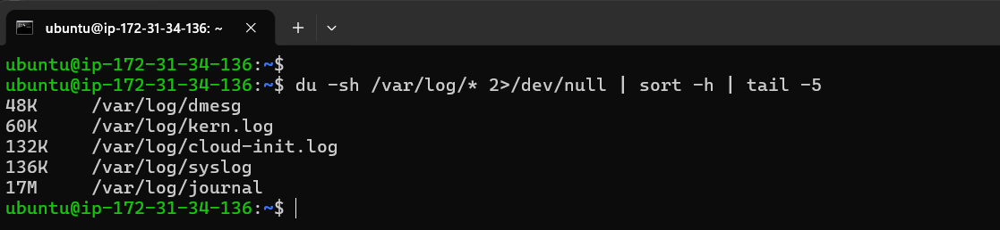
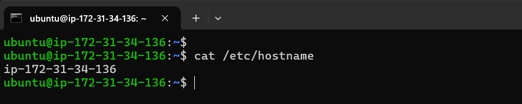
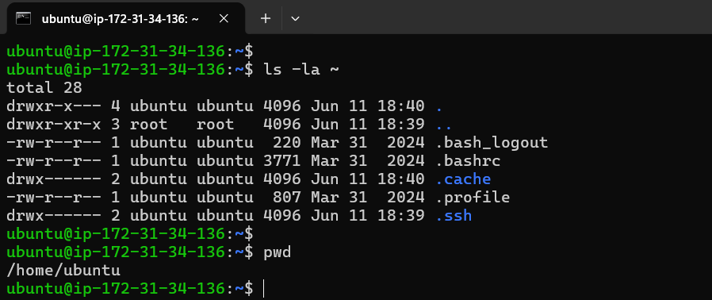

# Day 07 – Linux File System Hierarchy & Scenario-Based Practice

**Goal:** To understand where things live in Linux and practice troubleshooting like a DevOps engineer.

## Part 1: Linux File System Hierarchy

**Core Directories (Must Know):**

- `/` (Root Directory)
    - **Purpose:** The root directory is the top-level directory in Linux. Every file and directory starts from `/`.
    - **Example:** `ls -l /` → shows `bin`, `etc`, `home`, `var`.
    - **Use case:** I would use this when navigating the overall Linux file system structure or locating major system directories.
- `/home`
    - **Purpose:** Contains home directories for normal users. User-specific files, documents, and configurations are stored here.
    - **Example:** `ls -l /home` → shows `ubuntu`, `devops`.
    - **Use Case:** I would use this when managing user files, scripts, SSH keys, or personal configurations.
- `/root`
    - **Purpose:** Home directory of the root user (administrator).
    - **Example:** `ls -l /root` → shows `.bashrc`, `.ssh`.
    - **Use Case:** I would use this when performing administrative tasks as the root user.
- `/etc`
    - **Purpose:** Stores system-wide configuration files and service configurations.
    - **Example:** `ls -l /etc` → shows `hostname`, `hosts`, `ssh/`.
    - **Use Case:** I would use this when configuring services, networking, security settings, or system behavior.
- `/var/log`
    - **Purpose:** Contains system and application log files used for monitoring and troubleshooting.
    - **Example:** `ls -l /var/log` → shows `syslog`, `auth.log`, `dmesg`.
    - **Use Case:** I would use this when investigating application failures, login issues, or system errors.
- `/tmp`
    - **Purpose:** Stores temporary files created by applications and users.
    - **Example:** `ls -l /tmp` → shows random temp files.
    - **Use Case:** I would use this when troubleshooting temporary storage issues or reviewing temporary application data.

**Additional Directories (Good to Know):**

- `/bin`
    - **Purpose:** Contains essential command binaries required for system operation.
    - **Example:** `ls -l /bin` → shows `ls`, `cat`, `bash`.
    - **Use Case:** I would use this when verifying availability of critical Linux commands.
- `/usr/bin`
    - **Purpose:** Contains user-level executable programs and utilities.
    - **Example:** `ls -l /usr/bin` → shows `python3`, `git`.
    - **Use Case: I would use this when locating installed applications and command-line tools.**
- `/opt`
    - **Purpose:** Stores optional or third-party software packages.
    - **Example:** `ls -l /opt` → shows `google/`, `custom-app/`.
    - **Use Case:** I would use this when installing or maintaining enterprise applications.

## Hands-On Tasks

**1. Find the largest log file in /var/log**

```bash
du -sh /var/log/* 2>/dev/null | sort -h | tail -5
```
**Why:** Shows the largest log files consuming disk space.

**Use Case:** Useful when troubleshooting disk space issues on production servers.

**Output:**



**2. Check Hostname Configuration**

```bash
cat /etc/hostname
```

**Why:** Displays the configured hostname of the server.

**Use Case:** Useful when identifying servers in multi-environment infrastructures.

**Output:**



**3. Check Home Directory Contents**

```bash
ls -la ~
```

**Why:** Shows hidden and visible files in the current user's home directory.

**Use Case:** Useful for locating SSH keys, shell configurations, and scripts.

**Output:**



---

## Part 2: Scenario-Based Troubleshooting

### Scenario 1: Service Not Starting

```
A web application service called 'myapp' failed to start after a server reboot.
What commands would you run to diagnose the issue?
Write at least 4 commands in order.
```

**Step 1:** 

```bash
systemctl status myapp
```

**Why:** Checks whether the service is running, failed, or inactive.

**Step 2:** 

```bash
journalctl -u myapp -n 50
```

**Why:** Reviews recent logs to identify startup failures.

**Step 3:** 

```bash
journalctl -xe
```

**Why:** Displays detailed system-wide errors that may affect the service.

**Step 4:** 

```bash
systemctl list-units --type=service
```

**Why:** To see what services exist on the system.

**Step 5:** 

```bash
systemctl is-enabled myapp
```

**Why:** To know if it will start automatically after reboot.

**Step 6:** 

```bash
systemctl cat myapp
```

**Why:** Reviews the service configuration file.

**What I learned:** 

- Always check status first, then investigate based on what you see.
- Always follow this flow: **Status → Logs → System Errors → Boot Configuration**
- This is exactly how production troubleshooting begins.

---

### Scenario 2: High CPU Usage

```
Your manager reports that the application server is slow.
You SSH into the server. What commands would you run to identify
which process is using high CPU?
```

**Step 1:** 

```bash
top
```

**Why:** Provides a live view of CPU and memory utilization.

**Step 2:** 

```bash
ps aux --sort=-%cpu | head -10
```

**Why:** Lists processes consuming the most CPU resources.

**Step 3:** 

```bash
ps -fp <PID>
```

**Why:** Identifies the exact process owner and command.

**Step 4:**

```bash
top -p <PID>
```

**Why:** Monitors the specific process in real time.

**What I learned:** 

Troubleshooting flow: 

```
Observe CPU usage
      ↓
Find top process
      ↓
Identify PID
      ↓
Investigate process details
```

---

### Scenario 3: Finding Service Logs

```
A developer asks: "Where are the logs for the 'docker' service?"
The service is managed by systemd.
What commands would you use?
```

**Step 1:** 

```bash
systemctl status docker
```

**Why:** Confirms whether Docker service is running and provides recent log entries.

**Step 2:** 

```bash
journalctl -u docker -n 50
```

**Why:** Shows the last 50 Docker log entries.

**Step 3:** 

```bash
journalctl -u docker -f
```

**Why:** Follows logs in real time similar to `tail -f`.

**Step 4:** 

```bash
journalctl -u docker --since "1 hour ago"
```

**Why:** Investigate logs during a specific time window.

**What I Learned:**

For systemd-managed services:

```
Service Status
      ↓
Historical Logs
      ↓
Real-Time Logs
```

---

### Scenario 4: File Permission Issue

```
A script at /home/user/backup.sh is not executing.
When you run it: ./backup.sh
You get: "Permission denied"

What commands would you use to fix this?
```

**Step 1:**

```bash
ls -l /home/user/backup.sh
```

**Why:** Verify current file permissions.

**Step 2:** 

```bash
chmod +x /home/user/backup.sh
```

**Why:**  Add execute permission.

**Step 3:** 

```bash
ls -l /home/user/backup.sh
```

**Why:** Verifies permission changes.

**Step 4:**

```bash
./backup.sh
```

**Why:** Executes the script to confirm resolution.

**What I Learned:**

```
Permission Denied
       ↓
Check Permissions
       ↓
Add Execute Permission
       ↓
Verify
       ↓
Run Again
```

---

## 🧠 Key Learnings:

### Linux Directories to Remember

| Directory | Importance |
| --- | --- |
| /etc | Configuration Files |
| /var/log | Troubleshooting Logs |
| /home | User Data |
| /root | Root User Files |
| /tmp | Temporary Data |
| /bin | Essential Commands |
| /usr/bin | Installed Utilities |
| /opt | Third-Party Applications |

### Production Troubleshooting Framework

```
Whenever something breaks:
1. Identify the problem
2. Check status
3. Review logs
4. Verify configuration
5. Apply fix
6. Validate result
7. Document findings
```

This mindset is far more valuable in production environments than memorizing commands.