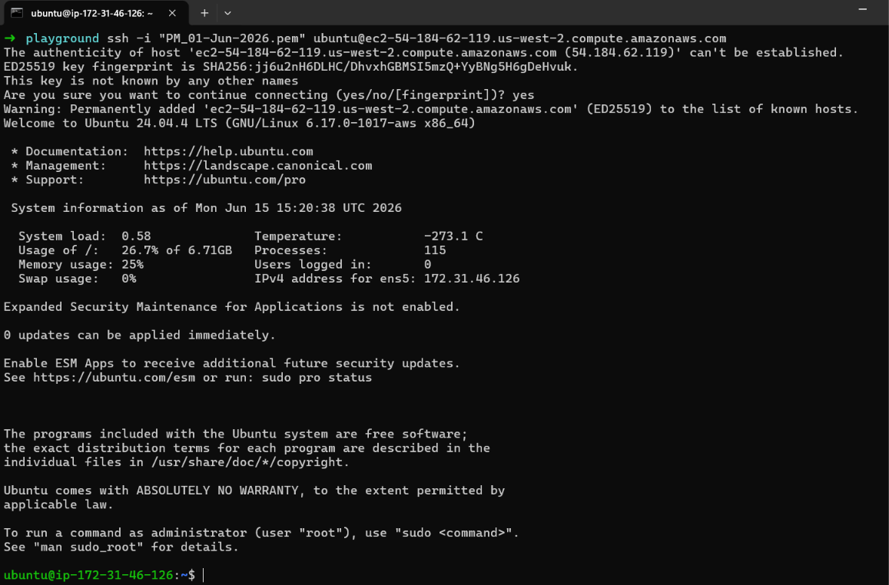
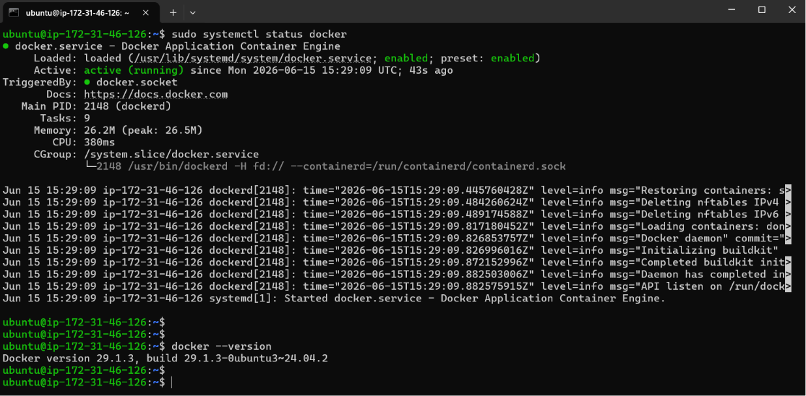
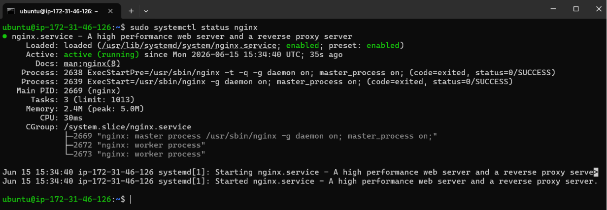
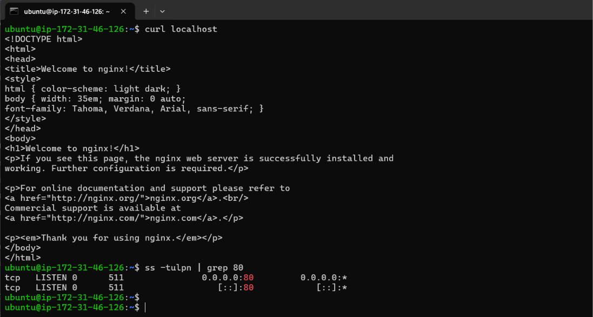
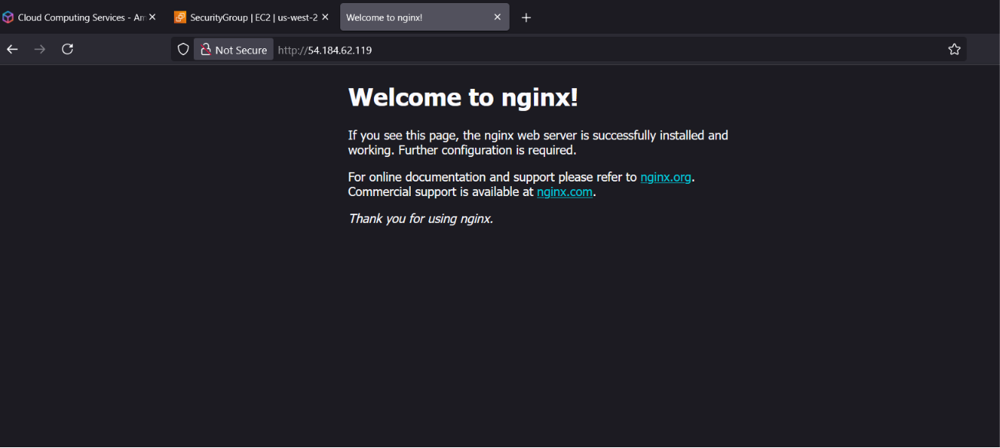
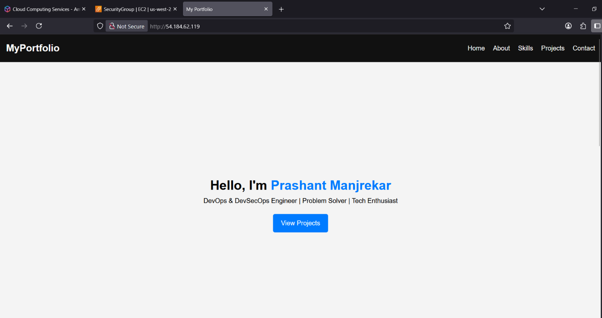
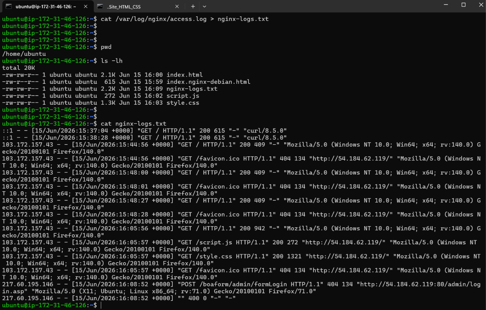
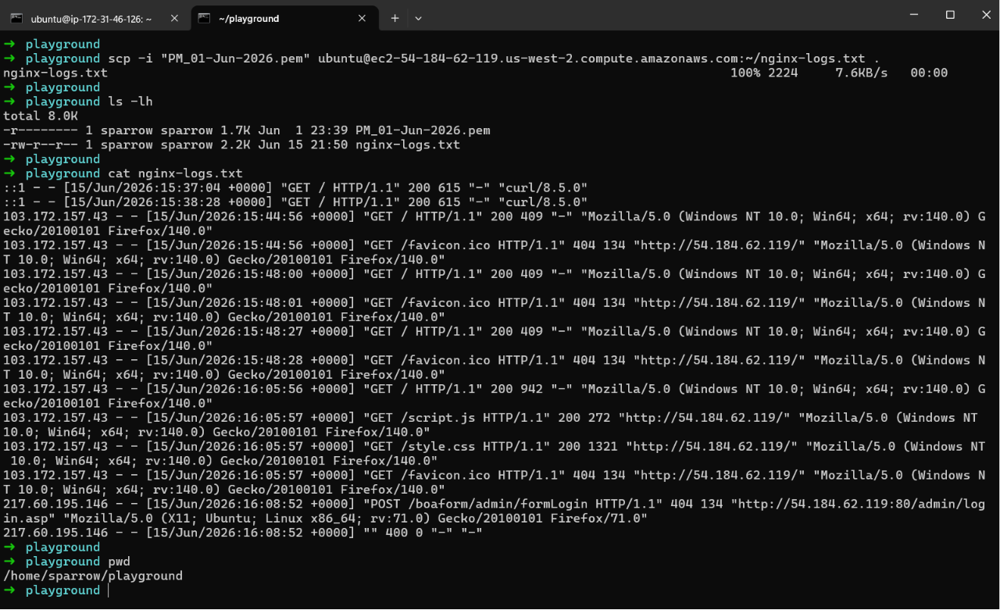

# Day 08 – Cloud Server Setup: Docker, Nginx & Web Deployment

**Goal:** Deploy a real web server on the cloud and learn practical server management.

## Part 1: Launch Cloud Instance & SSH Access

### Step 1: Create a EC2 Instance

- Launched an Ubuntu Linux instance on a AWS cloud provider (AWS EC2)
- Configured key pair for secure access
- Set security group rules for SSH (port 22)

### Step 2: Connect via SSH

- Connected to the EC2 instance using SSH from local terminal

```bash
chmod 400 your-key.pem
ssh -i your-key.pem ubuntu@<your-instance-ip>
```



---

## Part 2: Install Docker & Nginx

### Step 1: Update System

- Updated system packages to the latest versions.

```bash
sudo apt update && sudo apt upgrade -y
```

### Step 2: Install Docker

- Installed Docker

```bash
sudo apt install docker.io -y
```

- Started Docker Service

```bash
sudo systemctl enable docker
sudo systemctl start docker
```

- Checked Docker Service status:

```bash
sudo systemctl status docker
```

- Verified Docker

```bash
docker --version
```



### Step 3: Install Nginx

- Installed Nginx

```bash
sudo apt install nginx -y
```

- Started Nginx Service

```bash
sudo systemctl enable nginx
sudo systemctl start nginx
```

- Checked Nginx Service Status

```bash
sudo systemctl status nginx
```



- Verified Nginx

```bash
curl localhost
```

- Checked listening port

```bash
sudo ss -tulpn | grep 80
```



---

## Part 3: Security Group Configuration

### Test Web Access:

- Allowed inbound HTTP traffic on port **80** in the EC2 security group
- Opened browser and visited:

```
http://<your-instance-ip>
```

- Verified that the **Nginx welcome page** loads successfully



**Custom Website Deploymnet:**



---

## Part 4: Extract Nginx Logs

### Step 1: View Nginx Logs

```bash
sudo cat /var/log/nginx/access.log
```

### Step 2: Save Logs to File

```bash
sudo cat /var/log/nginx/access.log > nginx-logs.txt
ls -lh
```



### Step 3: Download Log File to Your Local Machine

```bash
# On your local machine (new terminal window)
scp -i your-key.pem ubuntu@<your-instance-ip>:~/nginx-logs.txt .
ls -lh
cat nginx-logs.txt
```



---

## Challenges Faced

- SSH permission denied → fixed using `chmod 400`
- Website not accessible → opened port 80 in security group
- Docker permission issue → added user to docker group
- SCP Permission Error → `sudo chown ubuntu:ubuntu ~/nginx-logs.txt`

--- 

## What I Learned

- How to launch and access a cloud VM using SSH.
- How to install and manage Docker and Nginx services.
- How Security Groups control inbound network access.
- How to verify services using systemctl and curl.
- How to inspect and export Nginx logs for troubleshooting.