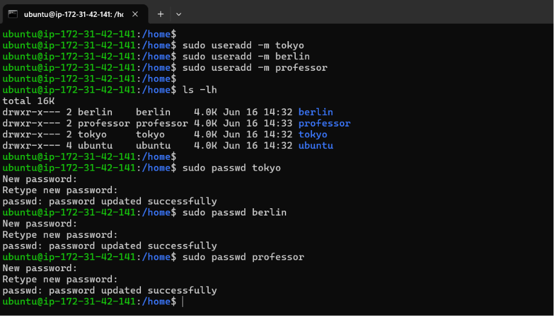
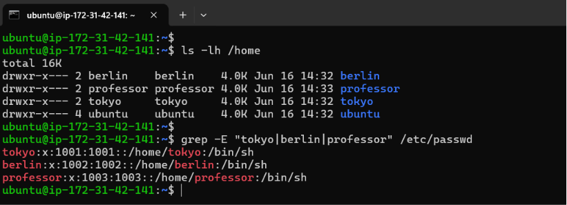
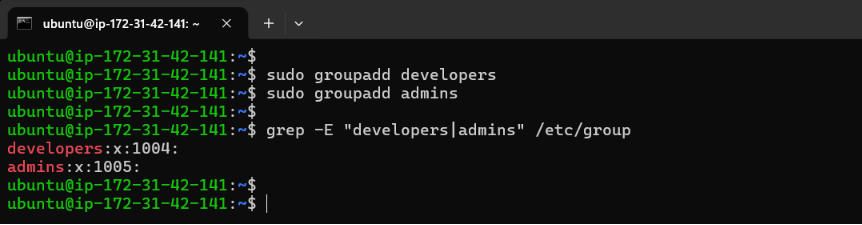
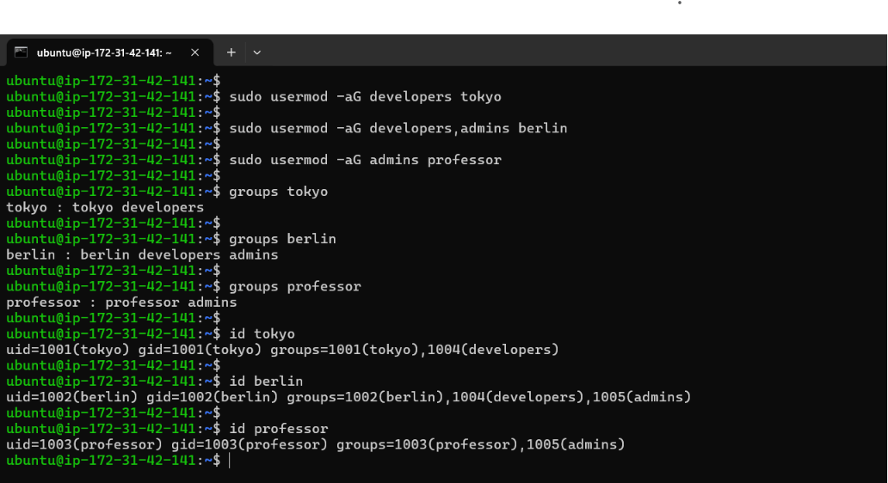
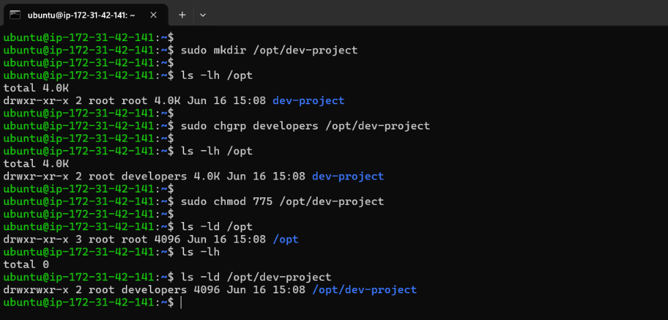
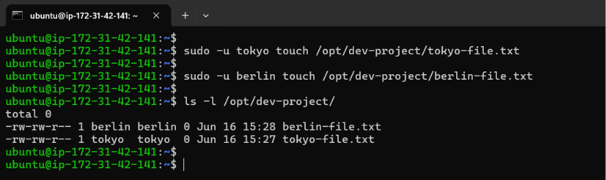
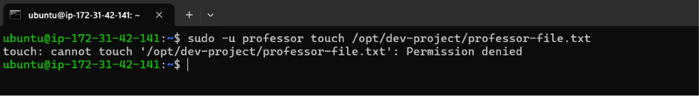
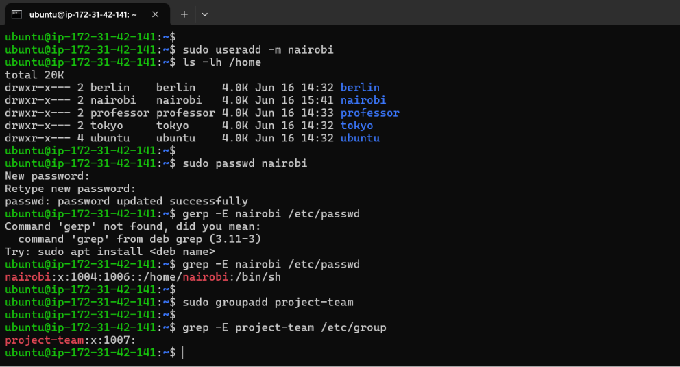
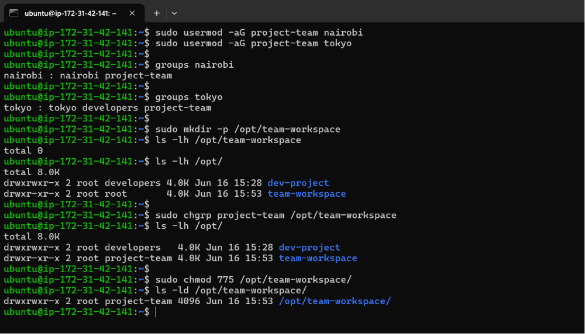
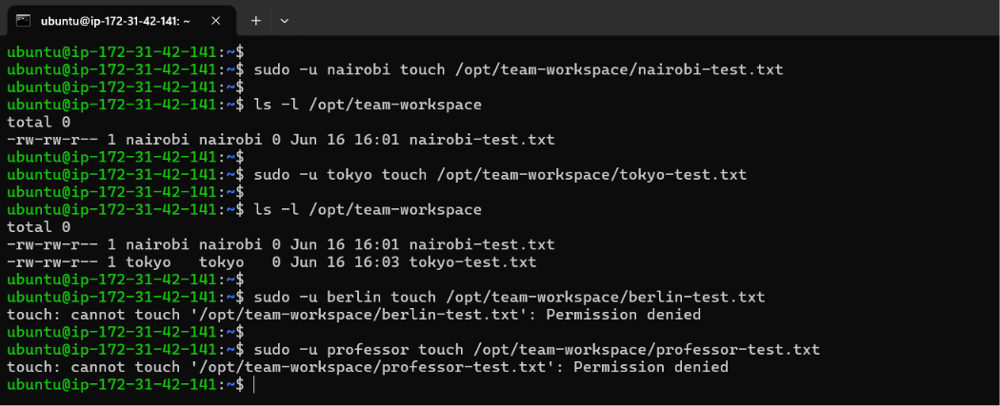

# Day 09 – Linux User & Group Management Challenge

**Goal:** Practice user and group management by completing hands-on challenges.

## Task 1: Create Users

Create three users with home directories and passwords:

- `tokyo`
- `berlin`
- `professor`

**Verify:** Check `/etc/passwd` and `/home/` directory

**Output:**





---

## Task 2: Create Groups

Create two groups:

- `developers`
- `admins`

**Verify:** Check `/etc/group`

**Output:**



---

## Task 3: Assign to Groups

Assign users:

- `tokyo` → `developers`
- `berlin` → `developers` + `admins` (both groups)
- `professor` → `admins`

**Verify:** Use appropriate command to check group membership

**Output:**



---

## Task 4: Shared Directory ****

1. Create directory: `/opt/dev-project`
2. Set group owner to `developers`
3. Set permissions to `775` (rwxrwxr-x)
4. Test by creating files as `tokyo` and `berlin`

**Verify:** Check permissions and test file creation

**Output:**







---

## Task 5: Team Workspace

1. Create user `nairobi` with home directory
2. Create group `project-team`
3. Add `nairobi` and `tokyo` to `project-team`
4. Create `/opt/team-workspace` directory
5. Set group to `project-team`, permissions to `775`
6. Test by creating file as `nairobi`

**Output:**







---

## Users & Groups Created

- **Users:** tokyo, berlin, professor, nairobi
- **Groups:** developers, admins, project-team

## Group Assignments

| User | Groups |
| --- | --- |
| tokyo | developers, project-team |
| berlin | developers, admins |
| professor | admins |
| nairobi | project-team |

## Directories Created

| Directory | Owner | Group | Permissions |
| --- | --- | --- | --- |
| /opt/dev-project | root | developers | 775 |
| /opt/team-workspace | root | project-team | 775 |

## Commands Used

**To Create Users with Home Directory:**

```bash
sudo useradd -m <username>
```

**To Set Password:**

```bash
sudo passwd <username>
```

**To Verify Created Users:**

```bash
grep -E "user1|user2|user3" /etc/passwd
```

**To Verify in Home Directories:**

```bash
ls -l /home
```

**To Create Groups:**

```bash
sudo groupadd <groupname>
```

**To Verify Created Groups:**

```bash
grep -E "group1|group2" /etc/group
```

**To Assign Users to Groups:**

```bash
sudo usermod -aG <groupname> <username>

# -a = append
# -G = supplementary groups
# Without -a, existing group memberships may be removed
```

**To Verify Users Added in Groups:**

```bash
groups <username>

# OR

id <username>
```

**To Change Group Ownership:**

```bash
sudo chgrp <group_name> </path/to/file_or_directory>

# OR

sudo chown :<group_name> </path/to/file_or_directory>
```

**To Set Permissions for Files/Directory:**

```bash
chmod <three-digit-number> </path/to/file_or_directory>

# OR

chmod <target><operator><permission> </path/to/file_or_directory>

# The Targets: u (User/Owner), g (Group), o (Others), a (All)
# The Operators: + (Add permission), - (Remove permission), = (Set exactly)
# The Permissions: r (Read), w (Write), x (Execute)
```

**To Verify Specific File/Directory Permission:**

```bash
ls -ld </path/to/directory> 

ls -l </path/to/file>
```

d**To Create File as Specific User:**

```bash
sudo -u <user_name> touch </path/to/file>
```

---

## What I Learned

1. Users are created using `useradd -m`, which automatically creates a home directory.
2. Groups simplify permission management by allowing multiple users to share access.
3. Linux permissions and ownership (`chmod`, `chgrp`) control who can read, write, and execute files and directories.
4. `usermod -aG` adds users to supplementary groups.
5. SGID ensures consistent group ownership in shared workspaces.

---

## 👉 Takeaway:

Completing this challenge gives you practical experience with Linux user management, group administration, permissions, and shared workspace configuration—core skills expected from DevOps engineers.