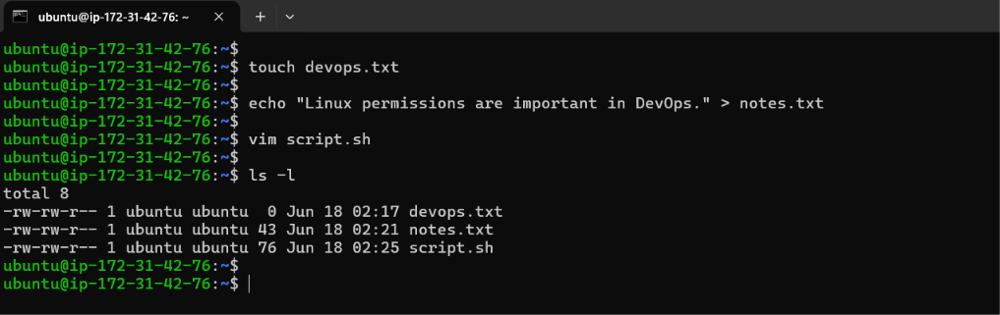
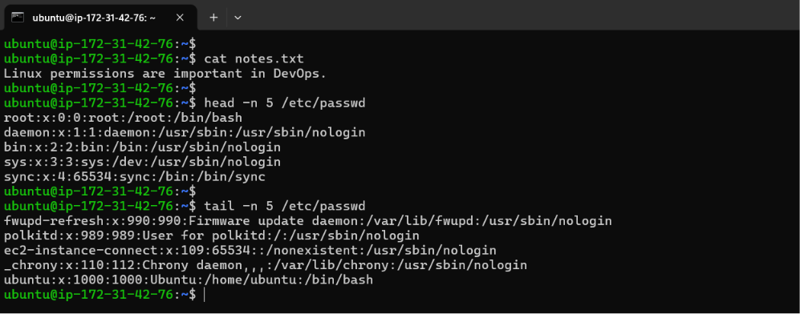
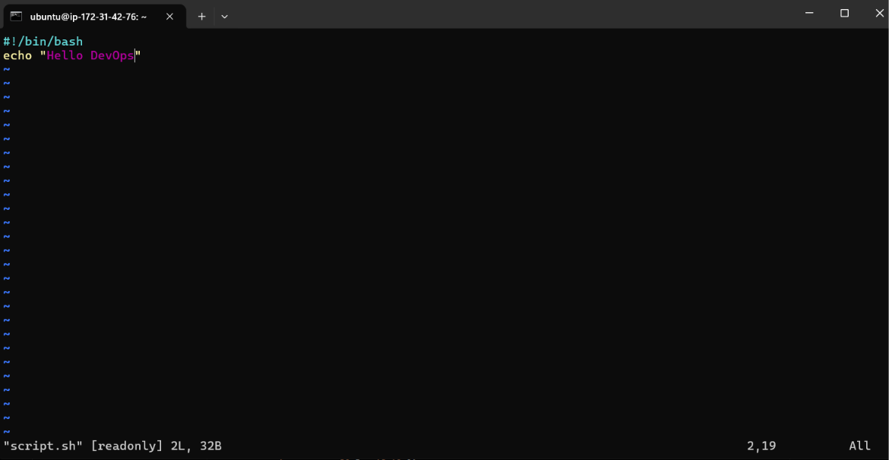
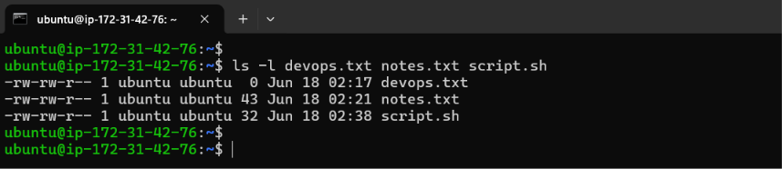
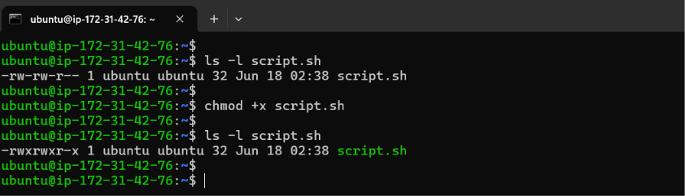
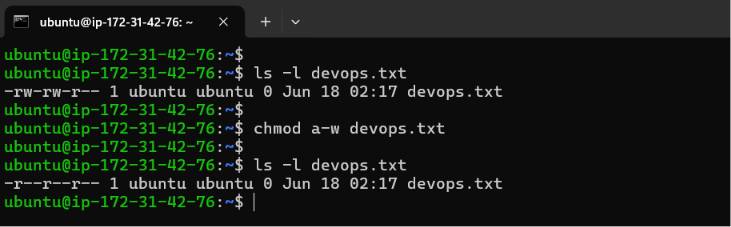
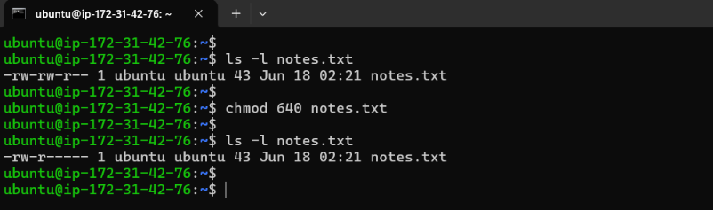
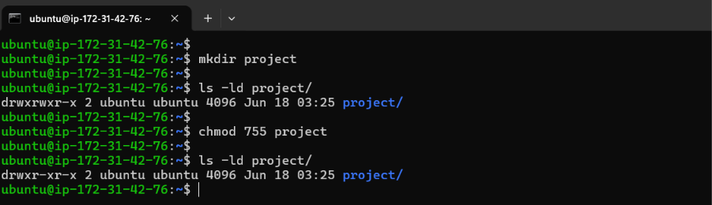
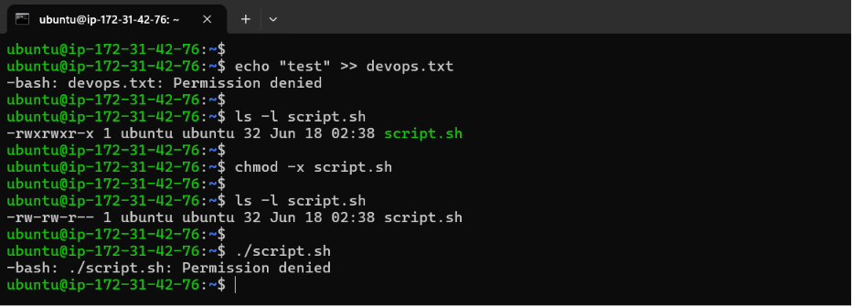
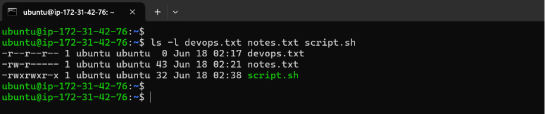

# Day 10 – File Permissions & File Operations Challenge

**Goal:** Master file permissions and basic file operations in Linux.

## Task 1: Create Files

1. Create empty file `devops.txt` using `touch`
2. Create `notes.txt` with some content using `cat` or `echo`
3. Create `script.sh` using `vim` with content: `echo "Hello DevOps"`

**Verify:** `ls -l` to see permissions

**Output:**

---

## Task 2: Read Files

1. Read `notes.txt` using `cat`
2. View `script.sh` in vim read-only mode
3. Display first 5 lines of `/etc/passwd` using `head`
4. Display last 5 lines of `/etc/passwd` using `tail`

**Output:**

---

## Task 3: Understand Permissions

Format: `rwxrwxrwx` (owner-group-others)

- `r` = read (4), `w` = write (2), `x` = execute (1)

Check your files: `ls -l devops.txt notes.txt script.sh`

Answer: What are current permissions? Who can read/write/execute?

**Output:**

| Files Created | Owner’s Permission | Group’s Permission | Other’s Permission |
| --- | --- | --- | --- |
| devops.txt | Read, Write | Read, Write | Read |
| notes.txt | Read, Write | Read, Write | Read |
| script.sh | Read, Write | Read, Write | Read |

---

## Task 4: Modify Permissions

1. Make `script.sh` executable → run it with `./script.sh`
2. Set `devops.txt` to read-only (remove write for all)
3. Set `notes.txt` to `640` (owner: rw, group: r, others: none)
4. Create directory `project/` with permissions `755`

**Verify:** `ls -l` after each change

**Output:**

---

## Task 5: Test Permissions

1. Try writing to a read-only file - what happens?
2. Try executing a file without execute permission
3. Document the error messages

**Output:**

- Write to read-only file → when attempted by a user without write permission → Permission denied
- Execute file without x permission → execute permission is missing → Permission denied

---

## Files Created

- devops.txt
- notes.txt
- script.sh

## Permission Changes

**Before Permission changes:**

**After Permission Changes:**

| Files Created | Before Permission Change | After Permission Change |
| --- | --- | --- |
| devops.txt | `-rw-rw-r--`  | `-r--r--r--` |
| notes.txt | `-rw-rw-r--` | `-rw-r-----` |
| script.sh | `-rw-rw-r--` | `-rwxrwxr-x` |

## Commands Used

- Create: `touch`, `cat > file`, `vim file`
- Read: `cat`, `head -n`, `tail -n` `vim -R`
- Permissions: `chmod +x`, `chmod -w`, `chmod 755`

## What I Learned

- Linux permissions are divided into owner, group, and others.
- Execute (`x`) permission is required to run shell scripts.
- `chmod` can modify permissions using symbolic or numeric notation.
- **The Targets:** `u (User/Owner), g (Group), o (Others), a (All)`
- **The Operators:** `+ (Add permission), - (Remove permission), = (Set exactly)`
- **The Permissions:** `r (Read), w (Write), x (Execute)`
- **Numeric:**
    - `7 = rwx`
    - `6 = rw-`
    - `5 = r-x`
    - `4 = r--`
- Always verify permissions using `ls -l`
- Common permission sets:
    - `755` → rwxr-xr-x (directories)
    - `640` → rw-r----- (restricted files)
    - `444` → read-only (secure files)
    - `777` → avoid as it grants full access to everyone

---

## 👉 Takeaway:

This challenge is foundational for Linux administration, CI/CD pipelines, Docker volumes, Kubernetes mounts, and production server security.