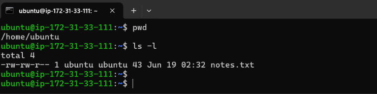
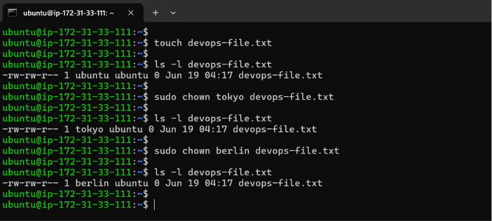
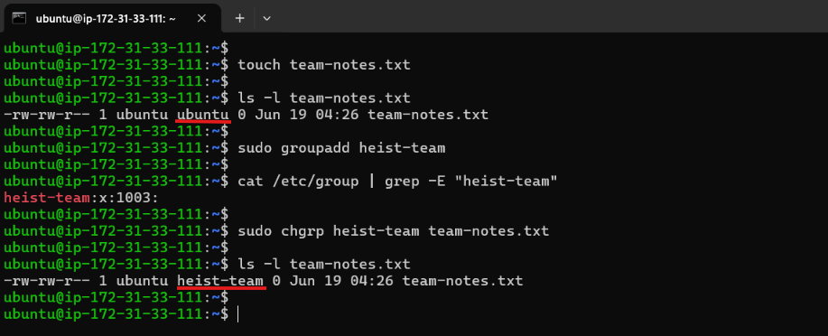
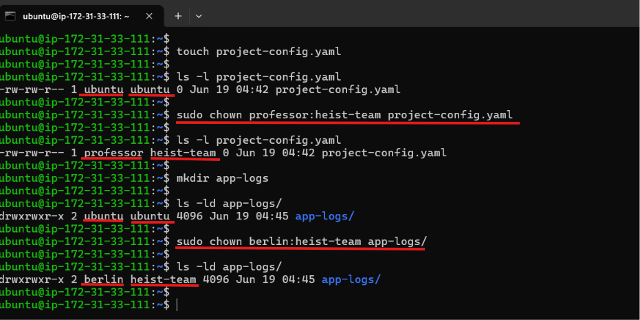
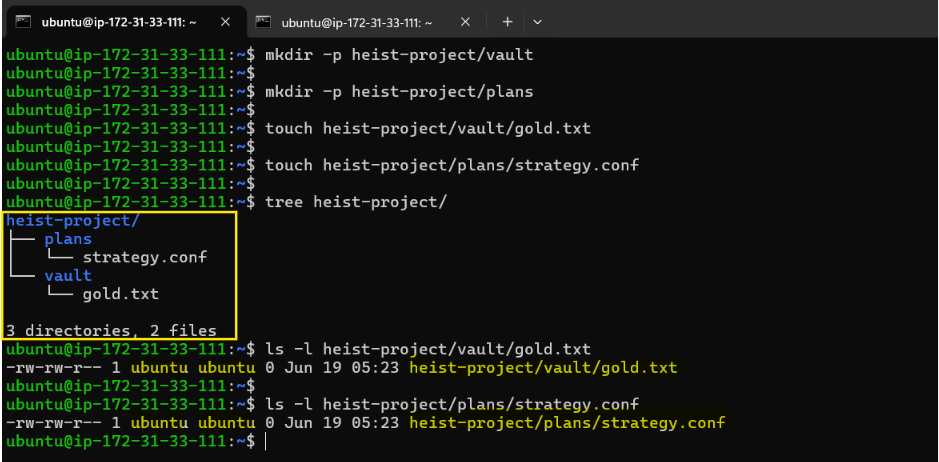
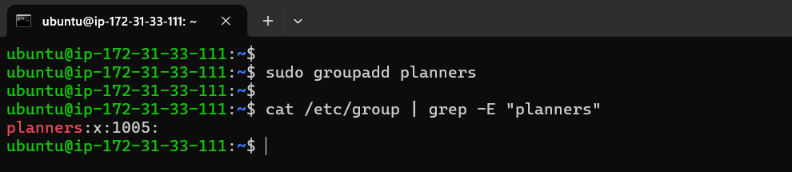
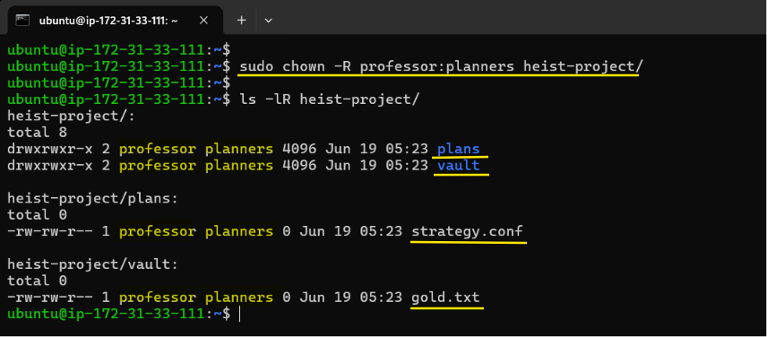
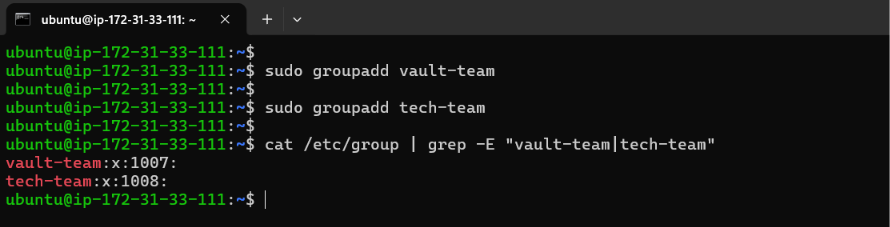
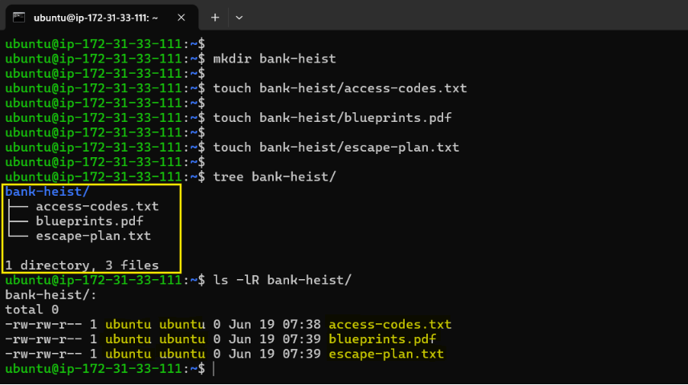
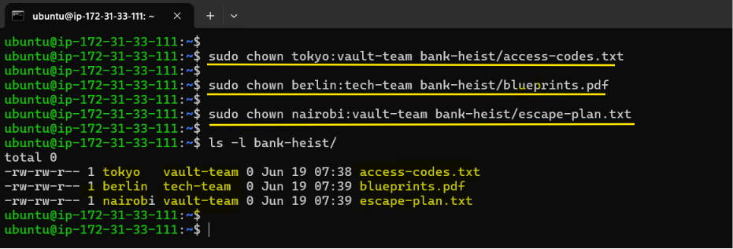

# Day 11 – File Ownership Challenge (chown & chgrp)

**Learning Objectives:** Master file and directory ownership in Linux.

- Understand file ownership (user and group)
- Change file owner using `chown`
- Change file group using `chgrp`
- Apply ownership changes recursively (`-R`)

---

## Task 1: Understanding Ownership

1. Run `ls -l` in your home directory
2. Identify the **owner** and **group** columns
3. Check who owns your files

**Format:** `-rw-r--r-- 1 owner group size date filename`

Document: What's the difference between owner and group?

**Output:**



**Understanding Each Column:**

| Field | Value | Meaning |
| --- | --- | --- |
| Permissions | `-rw-rw--r--` | Who can read/write the file |
| Links | `1` | Number of hard links |
| Owner | `ubuntu` | User who owns the file |
| Group | `ubuntu` | Group that owns the file |
| Size | `43` | File size in bytes |
| Date | `Jun 19 02:32` | Last modified date & time |
| Filename | `notes.txt` | Name of the file |

**Difference Between Owner and Group:**

**Owner**

- The owner is the specific user account that owns a file or directory.
- Typically, the user who creates the file becomes its owner.
- The owner can:
    - Read the file
    - Write or modify the file
    - Execute the file (if execute permission is granted)
    - Change file permissions
    - Change ownership (with appropriate privileges, usually using `sudo`)

**Group**

- A group is a collection of users who share common access permissions.
- Every file or directory is associated with a group.
- Users who belong to that group can access the file according to the permissions assigned to the group.
- Group ownership simplifies permission management by allowing multiple users to share access without assigning permissions individually.

**Example:**

```
-rw-r--r-- 1 ubuntu developers 1024 Jun 19 app.log
```

- **Owner:** `ubuntu`
- **Group:** `developers`

In this example, the user `ubuntu` owns the file, while members of the `developers` group can access the file according to the group permissions (`r--`).

---

## Task 2: Basic chown Operations 

1. Create file `devops-file.txt`
2. Check current owner: `ls -l devops-file.txt`
3. Change owner to `tokyo` (create user if needed)
4. Change owner to `berlin`
5. Verify the changes

**Try:**

```bash
sudo chown tokyo devops-file.txt
```

**Output:**



**Observation:**

- Only the owner changed.
- The group remains unchanged until explicitly modified.

---

## Task 3: Basic chgrp Operations

1. Create file `team-notes.txt`
2. Check current group: `ls -l team-notes.txt`
3. Create group: `sudo groupadd heist-team`
4. Change file group to `heist-team`
5. Verify the change

**Output:**



**Observation:**

- `chgrp` changes only the group ownership.

---

## Task 4: Combined Owner & Group Change

Using `chown` you can change both owner and group together:

1. Create file `project-config.yaml`
2. Change owner to `professor` AND group to `heist-team` (one command)
3. Create directory `app-logs/`
4. Change its owner to `berlin` and group to `heist-team`

**Syntax:** `sudo chown owner:group filename` 

**Output:**



**Observation:**

- The syntax `owner:group` changes both ownership values in one command.

---

## Task 5: Recursive Ownership

1. Create directory structure:

```bash
mkdir -p heist-project/vault
mkdir -p heist-project/plans
touch heist-project/vault/gold.txt
touch heist-project/plans/strategy.conf
```



2. Create group `planners`: `sudo groupadd planners`



3. Change ownership of entire `heist-project/` directory:
    - Owner: `professor`
    - Group: `planners`
    - Use recursive flag (`R`)
4. Verify all files and subdirectories changed: `ls -lR heist-project/` 



**Observation:**

- The `-R` flag applies ownership changes recursively to all files and subdirectories.

---

## Task 6: Practice Challenge

1. Create users: `tokyo`, `berlin`, `nairobi` (if not already created)
2. Create groups: `vault-team`, `tech-team`



3. Create directory: `bank-heist/`
4. Create 3 files inside:

```bash
touch bank-heist/access-codes.txt
touch bank-heist/blueprints.pdf
touch bank-heist/escape-plan.txt
```



5. Set different ownership:
    - `access-codes.txt` → owner: `tokyo`, group: `vault-team`
    - `blueprints.pdf` → owner: `berlin`, group: `tech-team`
    - `escape-plan.txt` → owner: `nairobi`, group: `vault-team`

**Verify:** `ls -l bank-heist/` 



---

## Files & Directories Created

```
- devops-file.txt
- team-notes.txt
- project-config.yaml
- app-logs/
- heist-project/
    - vault/
        - gold.txt
    - plans/
        - strategy.conf
- bank-heist/
    - access-codes.txt
    - blueprints.pdf
    - escape-plan.txt
```

## Ownership Changes

| File/Directory | Before | After |
| --- | --- | --- |
| `devops-file.txt` | `ubuntu:ubuntu` | `tokyo:ubuntu` → `berlin:ubuntu` |
| `team-notes.txt` | `ubuntu:ubuntu` | `ubuntu:heist-team` |
| `project-config.yaml` | `ubuntu:ubuntu` | `professor:heist-team` |
| `app-logs/` | `ubuntu:ubuntu` | `berlin:heist-team` |
| `heist-project/ (all files)` | `ubuntu:ubuntu` | `professor:planners` |
| `access-codes.txt` | `ubuntu:ubuntu` | `tokyo:vault-team` |
| `blueprints.pdf` | `ubuntu:ubuntu` | `berlin:tech-team` |
| `escape-plan.txt` | `ubuntu:ubuntu` | `nairobi:vault-team` |

## Commands Used

```bash
# View ownership
ls -l filename

# Change owner only
sudo chown newowner filename

# Change group only
sudo chgrp newgroup filename

# Change both owner and group
sudo chown owner:group filename

# Recursive change (directories)
sudo chown -R owner:group directory/

# Change only group with chown
sudo chown :groupname filename
```

## What I Learned

- **Owner vs Group**
    - The **owner** of a file has primary control over it, while the **group** allows multiple users to share access based on assigned permissions.
- **`chown` vs `chgrp`**
    - `chown` changes the file owner and can also modify the group ownership.
    - `chgrp` changes only the group ownership of a file or directory.
- **Recursive Ownership (`R`)**
    - Using `chown -R` applies ownership changes to a directory and all its contents, making it essential for managing application deployments, shared project folders, and log directories.

## 👉 Takeaway:

- Correct ownership prevents application permission issues.
- Shared groups simplify collaboration between teams.
- Recursive ownership changes save time when managing large project structures.
- Proper ownership management is critical for CI/CD pipelines, container volumes, application logs, and deployment directories.