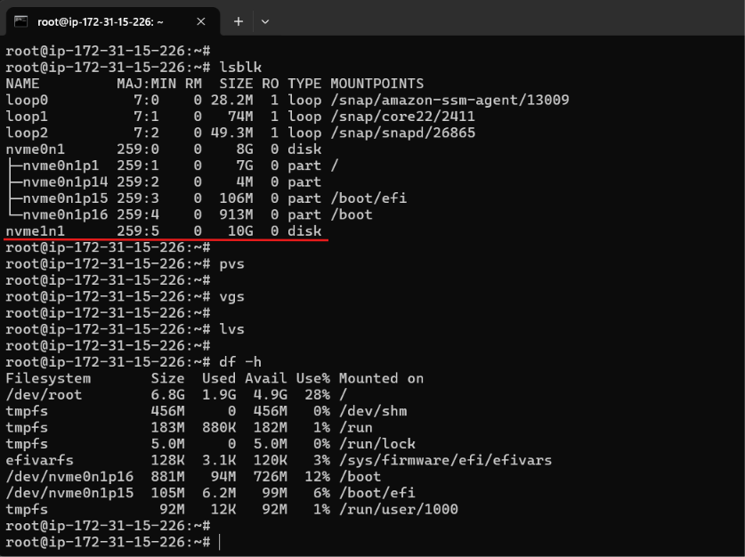
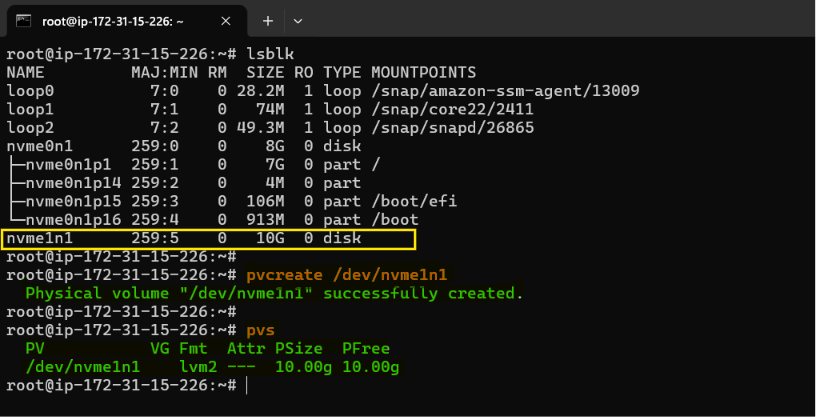
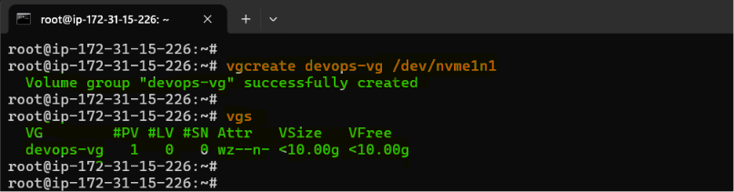
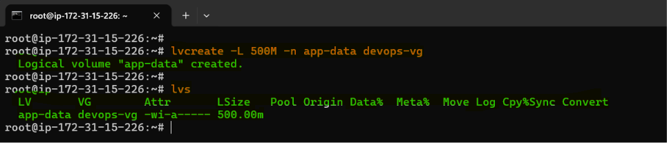
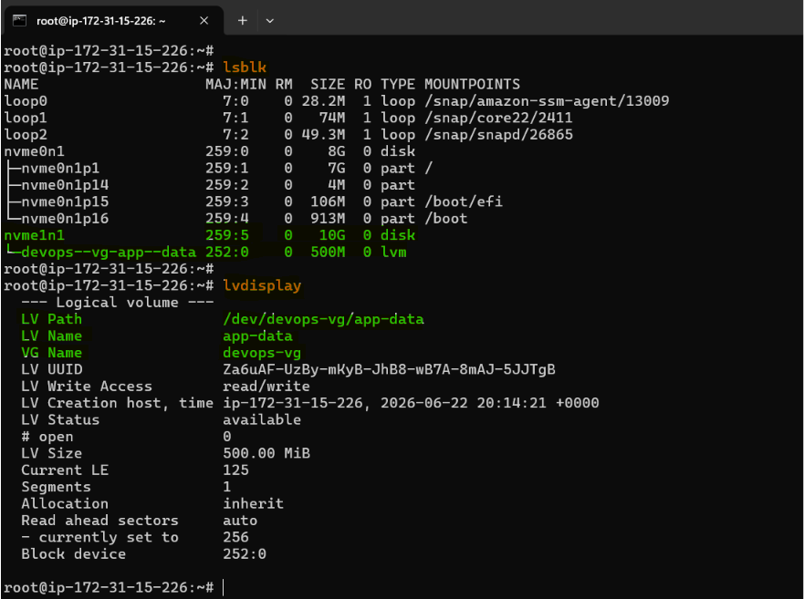
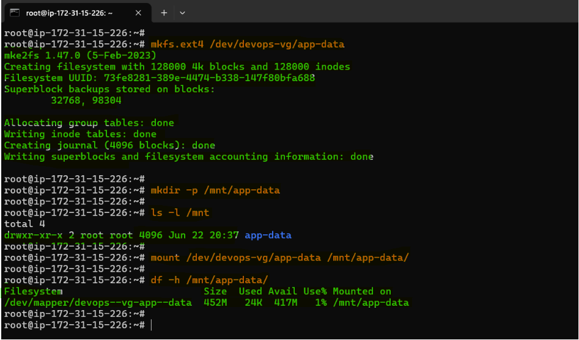
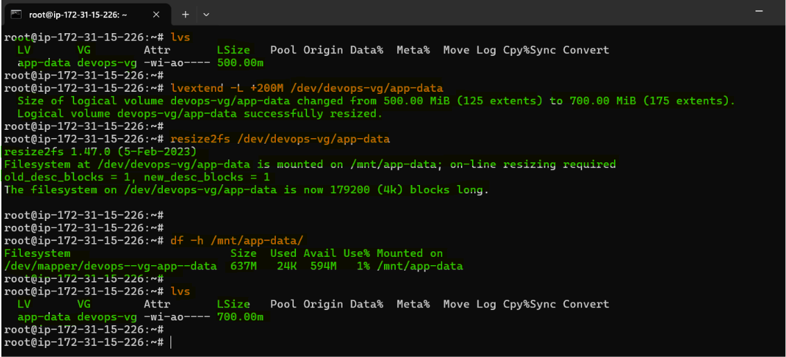
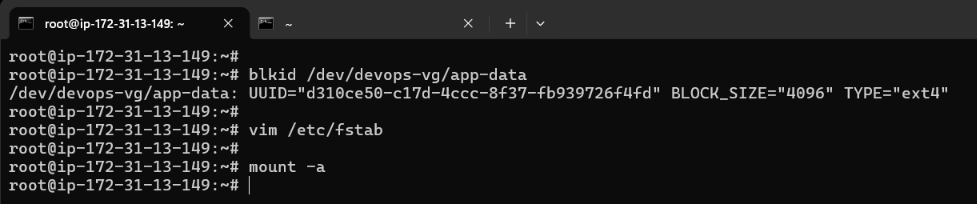
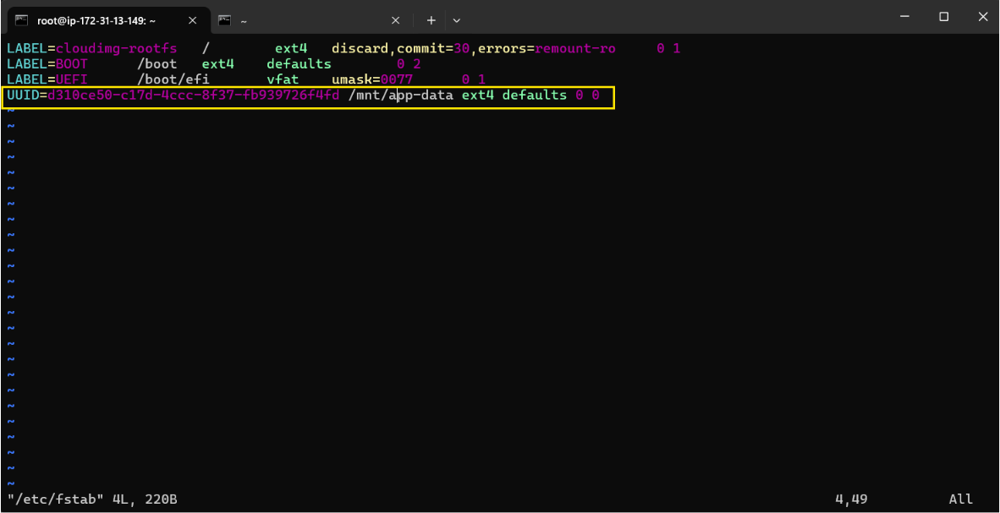
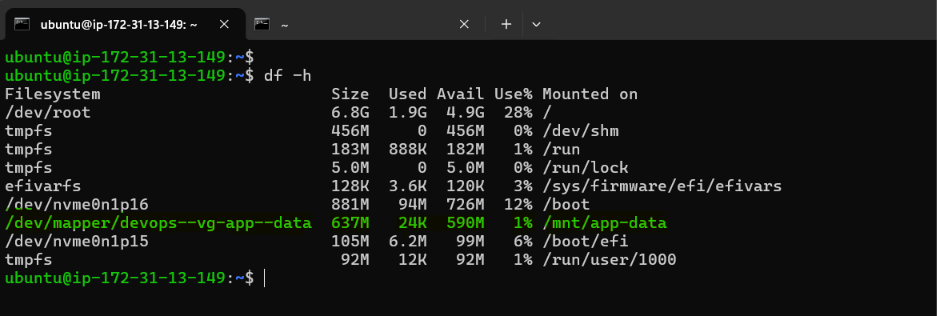

# Day 13 – Linux Volume Management (LVM)

**Learning Objective:** Learn how to manage storage using LVM by creating Physical Volumes (PV), Volume Groups (VG), and Logical Volumes (LV).

**Scenario:**

- EC2 instance (Linux)
- New EBS volume (10GB) attached
- Goal: Build LVM stack on top of it
- Switch to root user: `sudo -i`  or `sudo su`

---

## Task 1: Check Current Storage

Run: `lsblk`, `pvs`, `vgs`, `lvs`, `df -h` 

**Output:**



**Observation:**

| Device | Size | Mountpoint | Notes |
| --- | --- | --- | --- |
| /dev/nvme0n1 | 8G | / | Root filesystem |
| /dev/nvme1n1 | 10G | - | Free disk available |

- A free disk (`/dev/nvme1n1`) is available for LVM.
- No existing physical volumes, volume groups, or logical volumes
- `/dev/root` usage: 6.8G, 28% used

---

## Task 2: Create Physical Volume (PV)

```bash
pvcreate /dev/nvme1n1
pvs
```

**Output:**



**Observation:**

- `/dev/nvme1n1` initialized as a physical volume
- `pvs` shows it ready for LVM

---

## Task 3: Create Volume Group (VG)

```bash
vgcreate devops-vg /dev/nvme1n1
vgs
```

**Output:**



**Observation:**

- Volume group `devops-vg` created with 10G free space

---

## Task 4: Create Logical Volume (LV)

```bash
lvcreate -L 500M -n app-data devops-vg
lvs
```

**Output:**





**Observation:**

- Logical volume `app-data` of 500MB created under `devops-vg`

---

## Task 5: Format and Mount

```bash
mkfs.ext4 /dev/devops-vg/app-data
mkdir -p /mnt/app-data
mount /dev/devops-vg/app-data /mnt/app-data
df -h /mnt/app-data
```

**Output:**



**Observation:**

- LV formatted as `ext4`
- Mounted at `/mnt/app-data`
- Filesystem shows: Size 452M, Used 24K, Available 417M (filesystem overhead reduces usable size)

---

## Task 6: Extend the Volume

```bash
lvextend -L +200M /dev/devops-vg/app-data
resize2fs /dev/devops-vg/app-data
df -h /mnt/app-data
```

**Output:**



**Observation:**

- LV size increased by 200MB (total 700MB)
- Filesystem resized to use new space
- Filesystem shows: Size 637M, Used 24K, Available 594M (filesystem overhead applies)

**Note:** 

For ext4 filesystems, after increasing the LV size, `resize2fs` grows the filesystem to use the newly available space. A commonly used shortcut is `lvextend -r`, which can resize the filesystem automatically.

---

## LVM Architecture:

- LVM cannot use raw disks directly, first it converts to Physical Volume, `Disk → Physical Volume`
- `pvcreate` initializes a device for use by LVM and makes it available to be added to a volume group.
- A Volume Group combines one or more PVs into a single storage pool from which Logical Volumes are allocated `Disk → Physical Volume → Volume Group`
- `lvcreate` allocates space from the VG and creates a virtual block device for use by filesystems and applications. `Disk → Physical Volume → Volume Group -> Logical Volume`

```
LVM Architecture

Physical Disk
      ↓
Physical Volume (PV)
      ↓
Volume Group (VG)
      ↓
Logical Volume (LV)
      ↓
Filesystem
      ↓
Mount Point
```

---

##  Make mount persistent after reboot. Without this, reboot will lose the mount.

Get UUID:

```bash
blkid /dev/devops-vg/app-data
```

**Output:**



Edit `/etc/fstab` :

```bash
vim /etc/fstab

# add

UUID=12345678-abcd-1234-abcd-1234567890ab /mnt/app-data ext4 defaults 0 0

# verify

mount -a 

# No output = success
```

**Output:**





---

## Commands:

### 1. Check Current Storage

```bash
lsblk      # List all block devices and partitions
pvs        # Show existing physical volumes
vgs        # Show existing volume groups
lvs        # Show existing logical volumes
df -h      # Show mounted filesystems and their usage
```

### 2. Create Physical Volume

```bash
# Initialize /dev/block-device as a physical volume for LVM
pvcreate </dev/block-device-name>

# Verify physical volume creation
pvs
```

### 3. Create Volume Group

```bash
# Create a volume group with specific name
vgcreate <volume-group-name> </dev/block-device-name>

# Verify volume group creation
vgs
```

### 4. Create Logical Volume

```bash
# Create a logical volume with specific name with size in MB/GB
lvcreate -L <size_in_MB/GB> -n <logical-volume-name> <volume-group-name>

# Verify logical volume creation
lvs                                       
```

### 5. Format and Mount Logical Volume

```bash
# Format LV with ext4 filesystem
mkfs.ext4 <specify-path_as: /dev/volume-group-name/logical-volume-name>

# Create mount point
mkdir -p /mnt/<mountpoint-directory-name>

# Mount LV
mount <source: /dev/volume-group-name/logical-volume-name> <destination: mountpoint-directory-name>

# Verify mounted filesystem size and usage
df -h <mountpoint-directory-name>
```

### 6. Extend Logical Volume

```bash
# Extend LV by MB/GB
lvextend -L <+size_in_MB/GB> <specify-path_as: /dev/volume-group-name/logical-volume-name>

# Resize filesystem to use new space
resize2fs <specify-path_as: /dev/volume-group-name/logical-volume-name>

# Verify updated size and usage
df -h <mountpoint-directory-name>
```

---

## What I Learned

- LVM provides flexible storage management compared to traditional partitioning by introducing abstraction layers (PV → VG → LV).
- Physical Volumes are aggregated into Volume Groups, which act as a storage pool for creating Logical Volumes.
- Logical Volumes can be dynamically extended or reduced without repartitioning disks or impacting running systems.
- Filesystems can be expanded online after increasing LV size, enabling minimal or zero downtime storage scaling.
- After extending a Logical Volume, the filesystem must also be resized to utilize the newly allocated space.