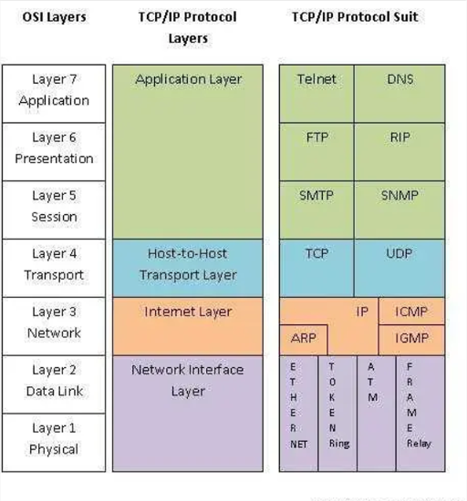
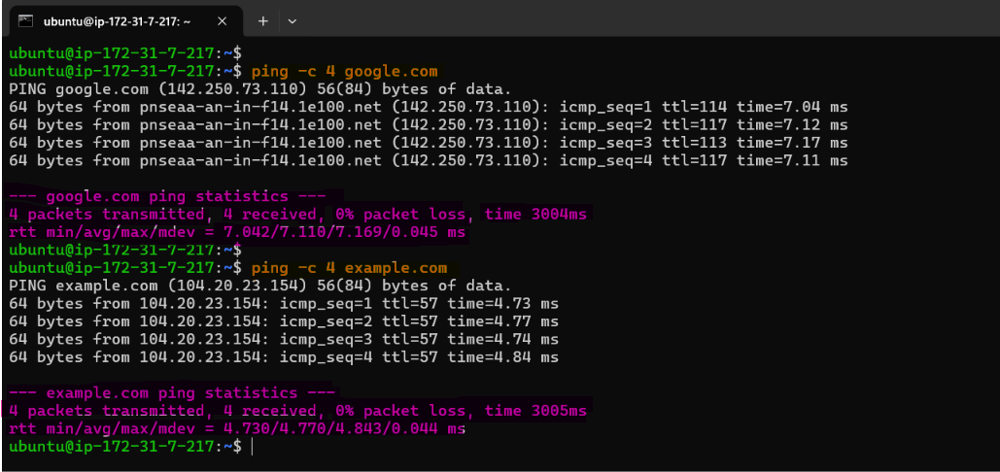
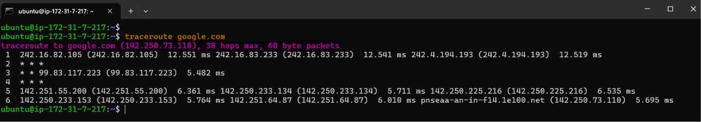
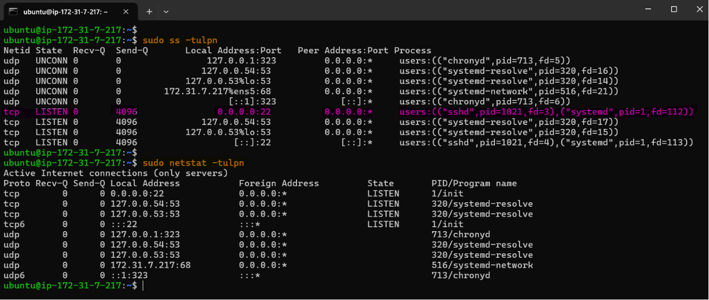
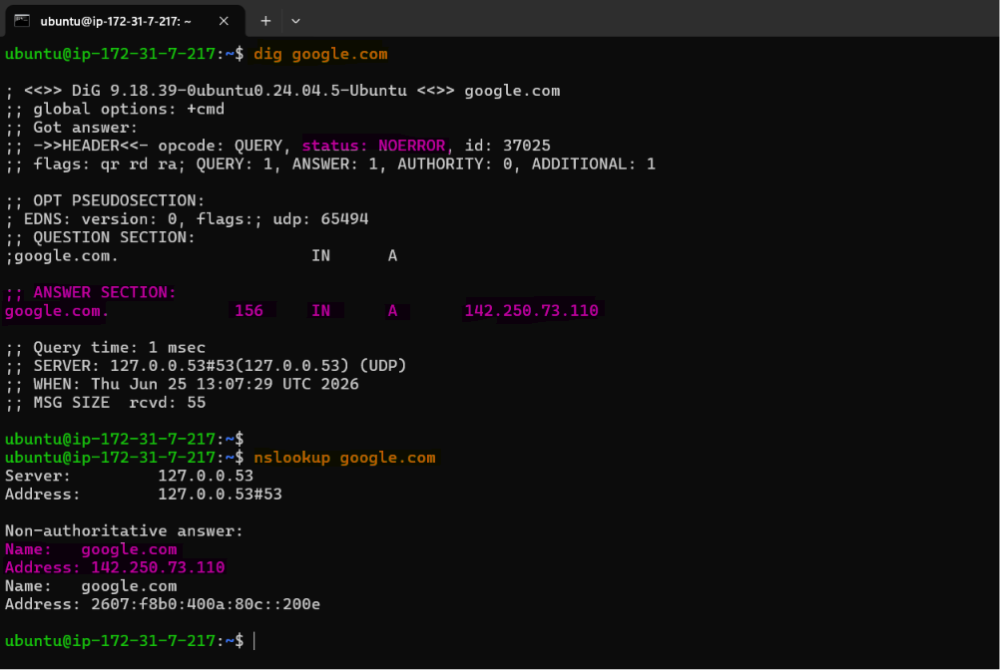
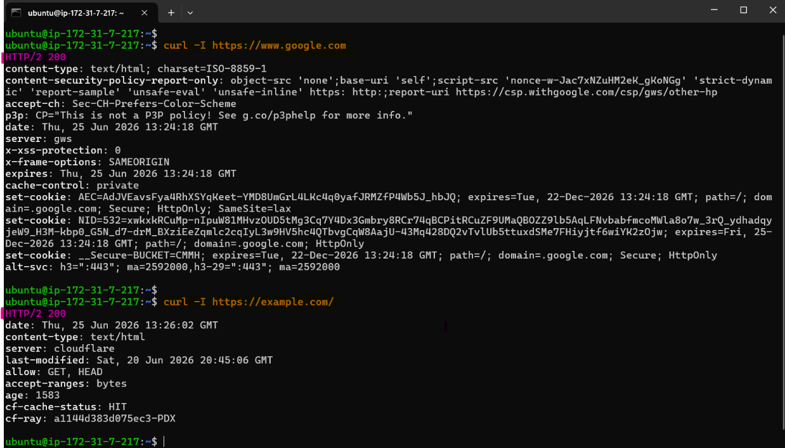
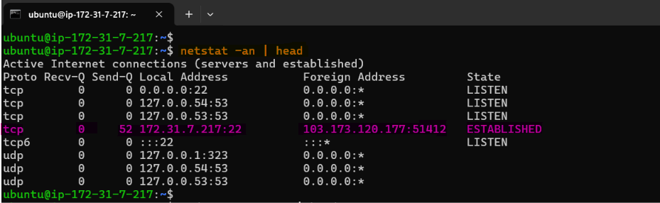
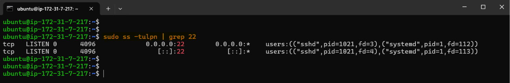
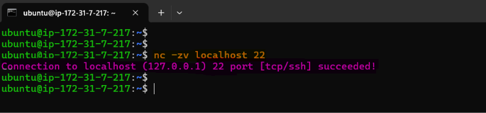

# Day 14 – Networking Fundamentals & Hands-on Checks

**Learning Objective:** Learn core networking concepts and practice common troubleshooting commands used in day-to-day DevOps operations.

## Quick Concepts

### OSI Layers (L1–L7) vs TCP/IP Stack (Link, Internet, Transport, Application)

**Diagram:** 



**OSI Model (7 Layers)**

OSI is a conceptual model that defines network communication. It consists of 7 layers where each layer performs a specific function, making network communication easier to analyze and debug.

- **L7 – Application:** Provides network services directly to end-user applications, such as web browsing, email, and file transfer.
- **L6 – Presentation:** Translates, encrypts, decrypts, and compresses data to ensure compatibility between systems.
- **L5 – Session:** Establishes, manages, and terminates communication sessions between applications.
- **L4 – Transport:** Ensures end-to-end communication, segmentation, flow control, and reliability (TCP) or fast delivery (UDP).
- **L3 – Network:** Handles logical addressing and routing of packets between different networks using IP addresses.
- **L2 – Data Link:** Provides node-to-node communication, framing, MAC addressing, and error detection on the local network.
- **L1 – Physical:** Transmits raw bits over physical media (cables, fiber, radio signals). Defines hardware, connectors, and signaling.

**TCP/IP Model (4 layers):**

The TCP/IP model is a layered networking framework that explains how data is communicated between devices over a network using standardized protocols to ensure reliable and efficient transmission.

Simpler and more practical, serves as the core framework of the modern Internet and networking systems, defined as a four-layer architecture consisting of

- **Application Layer:** Supports network services for user applications, including web browsing, email, file transfer, and DNS resolution (e.g., HTTP, SMTP, FTP, DNS).
- **Transport Layer:** Enables end-to-end communication, reliability, flow control, and multiplexing through protocols such as TCP and UDP.
- **Internet Layer:** Provides logical addressing and routing of packets across interconnected networks using protocols like IP.
- **Link Layer:** Handles physical network access, framing, MAC addressing, and data transmission over local network technologies such as Ethernet and Wi-Fi.

### Where **IP**, **TCP/UDP**, **HTTP/HTTPS**, **DNS** sit in the stack

| Protocol | Layer |
| --- | --- |
| IP | Internet Layer |
| TCP/UDP | Transport Layer |
| HTTP,HTTPS,DNS | Application Layer |

 ### One real example: **`curl https://example.com`** = App layer over TCP over IP

For this specific command:

1. `curl` resolves the hostname via DNS.
2. It opens a TCP connection to the server (typically port 443) using 3-way handshake.
3. It performs a TLS handshake to establish encryption.
4. It sends an HTTP request through that encrypted channel.
5. TCP breaks the data into segments.
6. IP wraps those segments into packets and routes them across networks.
7. The link layer sends them over Ethernet, Wi-Fi, cellular, etc.

```
Client                           Server
  |-------- SYN ----------------->|
  |<----- SYN-ACK ----------------|
  |-------- ACK ----------------->|   ← TCP connection established
  |
  |----- ClientHello ----------->|
  |<---- ServerHello ------------|
  |<---- Certificate ------------|
  |<---- Key Exchange -----------|
  |----- Finished -------------->|
  |<---- Finished ---------------|   ← TLS tunnel established
  |
  |----- HTTP GET / ------------>|   ← Actual application data
```

---

## Hands-on Checklist

**1. Identity**

```bash
hostname -I 

# OR 

ip addr show
```

**Output:**


**Observation:**

- System IP address is `172.31.7.217`.
- Used to identify the host on the local network.


**2. Reachability**

```bash
ping -c 4 google.com 
```

**Output:**



**Observation:**

- `google.com` is reachable.
- No packet loss observed.
- Average latency around 7.04 ms indicates healthy connectivity.


**3. Path Analysis**

```bash
traceroute <target> 

# OR 

tracepath <target>
```

**Output:**



**Observation:**

- Traffic successfully reached the destination i.e. `google.com` at hop 6.
- No significant delays observed.
- Some hops may show `* * *`, which is normal because some routers block ICMP.


**4. Listening Ports**

```bash
ss -tulpn 

# OR 

netstat -tulpn
```

**Output:**



**Observation:**

- SSH service is listening on TCP port 22.
- Indicates server is accepting SSH connections.


**5. Name Resolution**

```bash
dig <domain> 

# OR 

nslookup <domain>
```

**Output:**



**Observation:**

- Domain `google.com` successfully resolved name to IP address.
- Resolved IP:  `142.250.73.110`


**6. HTTP check**

```bash
curl -I <http/https-url>
```

**Output:**



**Observation:**

- Received response HTTP/1.1 200 OK.
- Server successfully responded and the resource is available.


**7. Connections snapshot**

```bash
netstat -an | head
```

**Output:**



**Observation:**

- Captured 1 ESTABLISHED connection on port 22 (the active SSH session) and multiple ports in LISTEN state

---

## Mini Task: Port Probe & Interpret

**Step 1: Identify Listening Port**

```bash
ss -tulpn | grep :22
```

**Output:**



**Step 2: From the same machine, test it:**

```bash
nc -zv localhost <port>
```

**Output:**



**Step 3: Interpretation**

- SSH service is listening on TCP port 22.
- Port 22 is reachable locally and the SSH service is accepting connections.

If unreachable:

```bash
Next checks:

# Check service status
systemctl status ssh 

# Check logs
journlctl -u ssh     
 
# Check firewall
sudo ufw status
```

---

## Reflection

### Q.1> Which command gives the fastest signal when something is broken?

- `ping`
- Reason:
    - Quickly verifies basic Layer 3 network reachability.
    - Reveals packet loss and latency immediately.

### Q.2> What layer (OSI/TCP-IP) would you inspect next if DNS fails? If HTTP 500 shows up?

**If DNS fails**

- DNS is an application-layer protocol, so troubleshoot first common issues include resolver misconfiguration, DNS service failure, or invalid records.
    - Checks: `dig google.com` , `cat /etc/resolv.conf`
- If unresolved, then next layer to inspect is the **Network Layer (Layer 3 of OSI) / Internet Layer (of TCP-IP)**
    - Checks: `ping` or `traceroute` to a public IP address (like `8.8.8.8`) to check if packets can actually leave your network.
- If the IP ping works but DNS still fails, move up to the **Transport Layer (Layer 4)** to check if UDP/TCP port 53 is blocked by a firewall.

**If HTTP 500 Shows Up**

We should inspect the **Application Layer** next.

- **Why:** An HTTP 500 error is an "Internal Server Error."
- This means layers 1 through 6 are working perfectly; the network, connection, and encryption are established, but the web server application itself crashed or encountered an unhandled exception.
- **Action:** Check the web server logs (e.g., Apache, Nginx) or application source logs to find the backend code error.

### Q.3> Two follow-up checks you’d run in a real incident.

**Check listening ports**

```bash
ss -tulpn
```

Verifies whether the expected service is running and listening.

**Check logs**

```bash
journalctl -xe
```

Helps identify service crashes, permission issues, and configuration errors.

---

## Key Learning

- OSI helps identify **where** a problem exists.
- TCP/IP explains **how** real-world traffic moves.
- A structured troubleshooting approach:

```
DNS
 ↓
Ping
 ↓
Traceroute
 ↓
Port Check
 ↓
HTTP Response
 ↓
Application Logs
```

Following the stack from Network to Application helps isolate issues quickly and reduces troubleshooting time during incidents.

---

## 👉Takeaway:

- A good DevOps engineer doesn't memorize commands—they understand **which layer is failing** and use the right tool to isolate the issue quickly.
- Networking troubleshooting becomes much easier when approached systematically rather than guessing.

---

## Refernece:

- https://www.geeksforgeeks.org/computer-networks/open-systems-interconnection-model-osi/
- https://www.geeksforgeeks.org/computer-networks/tcp-ip-model/
- https://www.geeksforgeeks.org/computer-networks/difference-between-osi-model-and-tcp-ip-model/