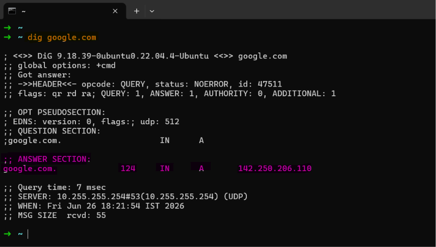
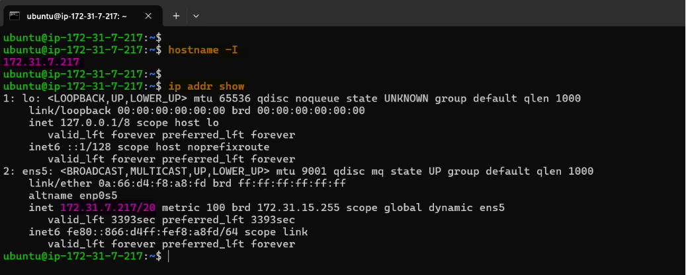

# Day 15 – Networking Concepts: DNS, IP, Subnets & Ports

**Learning Objective:** Understand the core networking concepts that every DevOps engineer uses daily.

- Understand how DNS resolves names to IPs
- Learn IP addressing (IPv4, public vs private)
- Break down CIDR notation and subnetting basics
- Know common ports and why they matter

## Task 1: DNS – How Names Become IPs

### 1. Explain in 3–4 lines: what happens when you type `google.com` in a browser?

1. When you type **google.com** into a browser, the browser first checks its local DNS cache. 
2. If the IP address isn't cached, it sends a DNS query to a DNS resolver. 
3. The resolver contacts DNS servers (Root → TLD → Authoritative DNS Server) until it finds the IP address for `google.com`, Authoritative server returns IP (A/AAAA) record. 
4. Once the IP is returned, the browser establishes a connection to that IP and loads the website.

### 2. What are these record types? Write one line each:

- `A`, `AAAA`, `CNAME`, `MX`, `NS`

| Record Type | Description | Example |
| --- | --- | --- |
| A (Address) | Maps a domain to an IPv4 address | Typing `example.com` sends users to the IPv4 address `192.0.2.1` |
| AAAA (IPv6 Address) | Maps a domain to an IPv6 address | Typing `example.com` sends users to the IPv6 address `2001:db8::1` |
| CNAME (Canonical Name) | Points a domain or subdomain as an alias to another domain name | Typing `://example.com` forwards users to the main domain `example.com` |
| MX (Mail Exchanger) | Specifies the mail server responsible for receiving emails for a domain. | An email sent to `user@example.com` routes to mail server `://example.com` |
| NS (Name Server) | Specifies which authoritative name servers hold the DNS records for a domain | Looking up `example.com` routes requests to `://domainregistrar.com` to find all records |

### 3. Run: `dig google.com` — identify the A record and TTL from the output

**Output:**



- **A Record:** `142.250.206.110`
- **TTL :** `124 seconds`

---

## Task 2: IP Addressing

### 1. What is an IPv4 address? How is it structured? 

- An IPv4 address is a **32-bit numerical address** used to uniquely identify a device on a network. It is divided into **four octets** and each ranging from **0 to 255**, separated by dots.
- For Example: `192.168.1.10`

    | Octet | Decimal | Binary |
    | --- | --- | --- |
    | 1 | 192 | 11000000 |
    | 2 | 168 | 10101000 |
    | 3 | 1 | 00000001 |
    | 4 | 10 | 00001010 |

- Components of an IPv4 Address
    1. **Network Portion:** Identifies the network to which the device belongs.
    2. **Host Portion:** Identifies the individual device on the network.
    3. **Subnet Mask:** Defines which part of the IP is network and which part is host.
- For Example: IP `192.168.1.10` with subnet mask `255.255.255.0`
    - **Network ID:** 192.168.1.0
    - **Host ID:** 10

### 2. Difference between public and private IPs — give one example of each

| Public IP | Private IP |
| --- | --- |
| Accessible over the Internet | Used inside private networks and are not routable on the internet |
| Assigned by an ISP | Assigned by routers (DHCP) or administrators |
| Must be globally unique | Can be reused in different networks |
| Example: If you host a website on your own web server, your ISP must assign a public IP address to your server so users around the world can access your site. | Example: In a typical home network, the router assigns private IP addresses to each device (like smartphones, laptops, smart TVs) from the reserved ranges. These devices use their private IPs to communicate with each other and with the router. The router uses NAT to allow these devices to access the internet using its public IP address. |

### 3. What are the private IP ranges?

| Range | CIDR |
| --- | --- |
| `10.0.0.0 – 10.255.255.255` | `10.0.0.0/8` |
| `172.16.0.0 – 172.31.255.255` | `172.16.0.0/12` |
| `192.168.0.0 – 192.168.255.255` | `192.168.0.0/16` |

### 4. Run: `ip addr show` — identify which of your IPs are private

**Output:**



Private IP: `172.31.7.217` 

---

## Task 3: CIDR & Subnetting

### 1. What does `/24` mean in `192.168.1.0/24`?

- CIDR notation specifies **network bits**.
- `/24` means that the **first 24 bits** of the IP address represent the **network portion**, while the remaining **8 bits** are available for host addresses.
- `192.168.1.10` with subnet mask `255.255.255.0`
    - **Network ID:** 192.168.1.0
    - **Host ID:** 10

### 2. How many usable hosts in a `/24`? `/16`? `/28`?

Formula: 

`Total IPs = 2^(32 - CIDR)`

`Usable Hosts = Total IPs - 2` 

**Note:** Network Address and Broadcast Address cannot be assigned to hosts.

| CIDR | Total IPs | Usable Hosts |
| --- | --- | --- |
| /24 | 256 | 254 |
| /16 | 65,536 | 65,534 |
| /28 | 16 | 14 |

### 3. Explain in your own words: why do we subnet?

- Subnetting divides a large network into smaller, manageable networks.
- It improves network performance, enhances security by isolating traffic, reduces broadcast domains, and helps efficiently utilize IP addresses.

### 4. Quick exercise — fill in:

| CIDR | Subnet Mask | Total IPs | Usable Hosts |
| --- | --- | --- | --- |
| /24 | `255.255.255.0` | 256 | 254 |
| /16 | `255.255.0.0` | 65,536 | 65,534 |
| /28 | `255.255.255.240` | 16 | 14 |

---

## Task 4: Ports – The Doors to Services

### 1. What is a port? Why do we need them?

- A port is a logical communication endpoint used by network services to receive and send data.
- Multiple applications can run on the same machine because each service listens on a different port number.
- Without ports, the operating system wouldn't know which application should receive incoming network traffic.
- For Example: `IP Address = House Address` where as `Port = Door Number`

### 2. Document these common ports:

| Port | Service |
| --- | --- |
| 22 | SSH |
| 80 | HTTP |
| 443 | HTTPS |
| 53 | DNS |
| 3306 | MySQL |
| 6379 | Redis |
| 27017 | MongoDB |

### 3. Run `ss -tulpn` — match at least 2 listening ports to their services

**Output:**

- Port 22 → SSH
- Port 53 → DNS

---

## Task 5: Putting It Together

### You run `curl http://myapp.com:8080` — what networking concepts from today are involved?

- The domain name `myapp.com` is first resolved to an IP address using DNS.
- Then a TCP connection is established to port **8080** on the destination server.
- After the connection is established, the HTTP request is sent and the server responds with the requested content.

### Your app can't reach a database at `10.0.1.50:3306` — what would you check first?

- I would first verify that the database server is reachable over the network by checking connectivity (using tools like `ping` if ICMP is allowed or `telnet`/`nc` to test the port), ensure that port **3306** is listening.
- If port is not listing then, verify firewall or security group rules for database server.
- If port is open but connection refused then confirm that the database service is running.
- And ensure the application is using the correct IP address and credentials.

===

**In details:**

**Target Resource:** `10.0.1.50:3306` (MySQL)

**Scope:** App Server to Database Server (Linux-to-Linux)


**PHASE 1: Triage & Isolation (From App Server)**

Execute these commands directly from the application server experiencing the failure.

**1. Check Basic Network Routing**

```bash
ping -c 4 10.0.1.50
```

- **100% Packet Loss:** Network path is broken or ICMP is blocked. Proceed to Step 2 anyway.
- **0% Packet Loss:** Server hardware/network layer is alive. Proceed to Step 2.

**2. Test Target Port Availability**

```bash
nc -zv 10.0.1.50 3306
```

**Analyze the output immediately:**

- **`Connection succeeded`**: Move to **Phase 4** (Auth/Credentials issue).
- **`Connection refused`**: Move to **Phase 2** (Database service down or listening locally).
- **`Connection timed out`**: Move to **Phase 3** (Firewall dropping packets).

===

**PHASE 2: Database Service Diagnosis (From DB Server)**

Follow this phase if `nc` returned **"Connection refused".**

**1. Check Service Status**

```bash
sudo systemctl status mysql
```

- **Action:** If `inactive` or `failed`, restart the service:

```bash
sudo systemctl start mysql
```

- **Verification:** Check error logs if it fails to start: `sudo tail -n 50 /var/log/mysql/error.log`

**2. Verify Bind Address (Listening Network)**

```bash
sudo ss -tlnp | grep 3306

# OR

sudo netstat -plnt | grep 3306
```

**Problem:** If output shows `127.0.0.1:3306`, the database is blocking remote networks.

**Fix:**

1. Open config file: `sudo nano /etc/mysql/mariadb.conf.d/50-server.cnf` or `/etc/mysql/my.cnf`
2. Locate `bind-address` and change it to: `bind-address = 0.0.0.0`
3. Restart service: `sudo systemctl restart mysql`

===

**PHASE 3: Firewall & Security Triage (From DB Server / Cloud)**

Follow this phase if `nc` returned **"Connection timed out"**.

**1. Check Local Linux Firewall**

```bash
sudo ufw status verbose

# If using iptables:

sudo iptables -L -n -v
```

- **Fix (UFW):** Explicitly allow the App Server IP to hit port 3306:

```bash
sudo ufw allow from <APP_SERVER_PRIVATE_IP> to any port 3306 proto tcp
sudo ufw reload
```

**2. Check Cloud Infrastructure Firewalls**

If local firewalls are clean, the block is at the infrastructure layer:

- **AWS:** Check the **Security Group** of the Database. Ensure an **Inbound Rule** allows TCP `3306` with the App Server's Security Group or Private IP as the source.
- **VPC / Subnet ACLs:** Verify that ACLs allow outbound traffic from the App subnet and inbound traffic to the DB subnet on port `3306`.

===

**PHASE 4: Authentication & Privileges (From App Server)**

Follow this phase if `nc` **succeeded** but the application still cannot connect.

1. Test Manual Login Connection

```bash
mysql -u <DB_USER> -p -h 10.0.1.50 -P 3306
```

- **Error: `Access denied for user...`:** The database user exists but lacks remote privileges.
- **Fix (Execute inside MySQL on the DB Server):**

```bash
sql
-- Check existing user scopes
SELECT user, host FROM mysql.user WHERE user='your_app_user';

-- Grant access to the app server IP
GRANT ALL PRIVILEGES ON your_database.* TO 'your_app_user'@'<APP_SERVER_PRIVATE_IP>' IDENTIFIED BY 'your_password';
FLUSH PRIVILEGES;

```

---

## Key Learnings

- **DNS** translates human-readable domain names into IP addresses.
- **IPv4** uniquely identifies devices on a network.
- **Private IPs** are used within internal networks, while **public IPs** are Internet-routable.
- **CIDR notation** defines the network size and available host addresses.
- **Subnetting** improves scalability, security, and efficient IP utilization.
- **Ports** allow multiple network services to coexist on the same host.
- Troubleshooting network issues often involves checking **DNS resolution**, **IP connectivity**, **port accessibility**, **routing**, and **firewall rules**.

---

## 👉Takeaway:

A strong understanding of DNS, IP addressing, CIDR, subnetting, and ports is essential because these concepts appear constantly in production troubleshooting:

- **DNS issue?** → Use `dig`, `nslookup`, or `host`.
- **Network issue?** → Use `ping`, `traceroute`, `ip addr`, `ip route`.
- **Port issue?** → Use `ss -tulpn`, `netstat`, `lsof -i`.
- **Connectivity issue?** → Use `curl`, `telnet`, or `nc` (netcat).
- **Firewall issue?** → Check `iptables`, `nftables`, `ufw`, cloud security groups, or network ACLs.