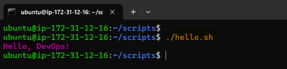
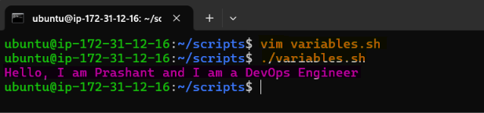
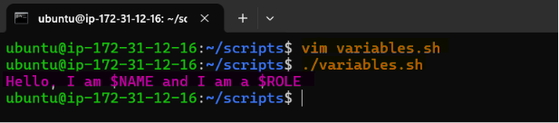
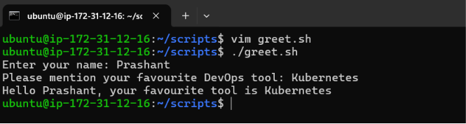
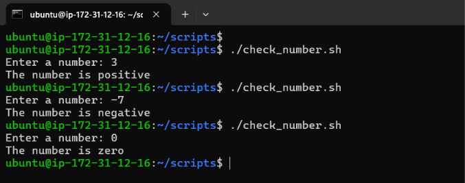
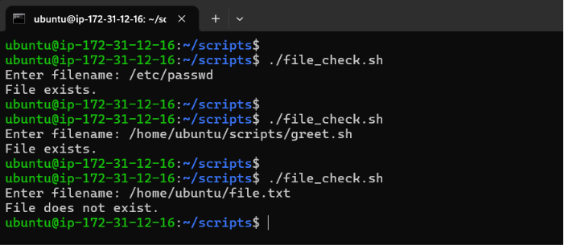
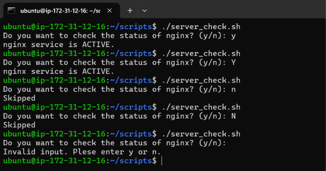
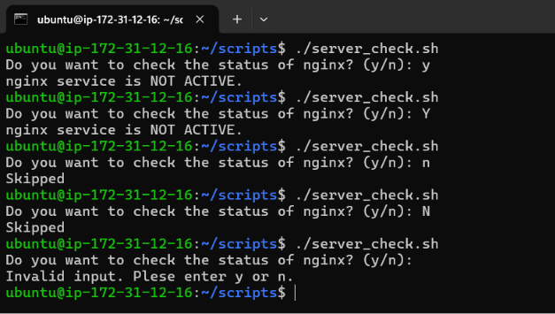

# Day 16 – Shell Scripting Basics

## Learning Objective:

Develop a strong foundation in Bash shell scripting by understanding how scripts are executed, how to work with variables and user input, implement decision-making using conditional statements, and combine these concepts into a practical automation script. As someone transitioning from traditional IT Operations to DevOps, this marks the first step toward replacing repetitive manual tasks with reusable automation.

---

## Task 1: Your First Script

1. Create a file `hello.sh`
2. Add the shebang line `#!/bin/bash` at the top
3. Print `Hello, DevOps!` using `echo`
4. Make it executable and run it

[**Script:** hello.sh](scripts/hello.sh)

**Output:**

**What happens if you remove the shebang line?**

- The shebang (`#!/bin/bash`) tells Linux execute this script using the **Bash interpreter** located at `/bin/bash` .
- If you remove the shebang line and running `./hello.sh` – the kernel checks for a shebang. If none is found, the system tries to execute the script using the current shell ( in our case current shell is Bash) so it will run the script.
- If you explicitly invoke Bash `bash hello.sh`, the script still works because you are directly telling Bash to interpret the file.
- If the script contains Bash-specific syntax and gets executed by another shell such as `sh` or `zsh` so it may fail with errors. Scripts becomes less portable and less predictable.
- For best practice, production DevOps script should always include a shebang at the top of executable shell scripts so they run with the intended interpreter.

**Observation:**

- The shebang (`#!/bin/bash`) specifies the interpreter used to execute the script.
- After assigning execute permission with `chmod +x`, the script can be run directly using `./hello.sh`.
- Omitting the shebang may still work in some environments, but it can lead to inconsistent behavior if the script is executed by a different shell.
- Including a shebang improves portability and ensures predictable execution.

---

## Task 2: Variables

1. Create `variables.sh` with:
    - A variable for your `NAME`
    - A variable for your `ROLE` (e.g., "DevOps Engineer")
    - Print: `Hello, I am <NAME> and I am a <ROLE>`
2. Try using single quotes vs double quotes — what's the difference?

[**Script:** variables.sh](scripts/variables.sh)

- Using double quote `" "` - Variables are expanded and display their values.

**Output:**

- Using single quote `' '` - Variables are treated as plain text.

**Output:**

**Observation:**

- Variables are assigned without spaces around the `=` operator.
- Variable expansion occurs only within double quotes (`"`); single quotes (`'`) preserve the text literally.
- Using descriptive variable names improves script readability and maintainability.
- Quoting variables is a recommended practice to handle values containing spaces or special characters.
- Best practice to declare variables:
    - Variable names are usually uppercase for constants or environment variables like `NAME, ROLE, TOOL`.
    - Local script variables often use lowercase like `name, tool` .

---

## Task 3: User Input with read

1. Create `greet.sh` that:
    - Asks the user for their name using `read`
    - Asks for their favourite tool
    - Prints: `Hello <name>, your favourite tool is <tool>`

[**Script:** greet.sh](scripts/greet.sh)

**Output:**

**Observation:**

- The `read` command captures user input at runtime and stores it in variables.
- The `p` option displays a prompt before accepting input, improving script usability.
- Interactive input makes scripts reusable by eliminating hard-coded values.
- User-provided values can be reused throughout the script as required.

---

## Task 4: If-Else Conditions

1. Create `check_number.sh` that:
    - Takes a number using `read`
    - Prints whether it is **positive**, **negative**, or **zero**

[**Script:** check_number.sh](scripts/check_number.sh)

**Output:**

**Observation:**

- Conditional statements (`if`, `elif`, `else`) enable decision-making based on user input.
- Numeric comparison operators such as `gt`, `lt`, and `eq` are used to evaluate integer values.
- Input validation ensures that different execution paths are handled correctly.
- Proper conditional logic improves script reliability and readability.

| Operator | Meaning |
| --- | --- |
| `-eq` | equal |
| `-ne` | not equal |
| `-gt` | greater than |
| `-lt` | less than |
| `-ge` | greater than or equal |
| `-le` | less than or equal |

2. Create `file_check.sh` that:
    - Asks for a filename
    - Checks if the file **exists** using `f`
    - Prints appropriate message

[**Script:** file_check.sh](scripts/file_check.sh)

**Output:**

**Observation:**

- The `-f` test operator verifies whether the specified path is an existing regular file.
- File validation helps prevent operations on non-existent files.
- Conditional checks provide appropriate feedback based on the file's availability.
- Similar test operators (`d`, `e`, `r`, `w`, `x`) are available for different file validations.

| Test | Meaning |
| --- | --- |
| `-f` | regular file exists |
| `-d` | directory exists |
| `-r` | readable |
| `-w` | writable |
| `-x` | executable |

---

## Task 5: Combine It All

Create `server_check.sh` that:

1. Stores a service name in a variable (e.g., `nginx`, `sshd`)
2. Asks the user: "Do you want to check the status? (y/n)"
3. If `y` — runs `systemctl status <service>` and prints whether it's **active** or **not**
4. If `n` — prints "Skipped."

[**Script:** server_check.sh](scripts/server_check.sh)

**Output:**

**Observation:**

- Service names can be stored in variables to improve script flexibility.
- User confirmation helps prevent unnecessary execution of administrative commands.
- Combining variables, user input, and conditional logic creates reusable operational scripts suitable for system administration tasks.
- `systemctl is-active --quiet` provides a reliable method for checking service status in automation scripts. The command exits with:

| Exit Code | Service State |
| --- | --- |
| `0` | active |
| `3` | inactive/failed |

---

## Key Learnings:

- The **shebang (`#!/bin/bash`)** specifies the interpreter and ensures consistent script execution across environments.
- Making a script executable with `chmod +x` allows it to be run directly.
- Variables improve script readability, maintainability, and reusability.
- Double quotes expand variables, whereas single quotes preserve literal text.
- The `read` command enables interactive scripts by accepting user input at runtime.
- Conditional statements (`if`, `elif`, `else`) provide decision-making capabilities that are essential for automation.
- File test operators such as `f` allow scripts to validate prerequisites before performing operations.
- Combining variables, user input, and conditional logic creates reusable operational utilities that reduce manual effort.
- Even basic Bash scripting introduces automation patterns that scale into configuration management, deployment workflows, and infrastructure orchestration.

---

## Takeaways:

This exercise reinforced that Bash scripting is more than a collection of Linux commands—it is the entry point to infrastructure automation. The concepts covered here mirror real operational tasks such as validating system state, interacting with users, checking service health, and handling runtime decisions. Mastering these fundamentals provides a strong foundation for advancing into automation tools like Ansible, CI/CD pipelines, Infrastructure as Code, and broader Platform Engineering practices, where Bash remains a critical integration layer.

---

## References:

https://www.shellrag.com/tutorials/bash/scripting-basics?utm_source=chatgpt.com