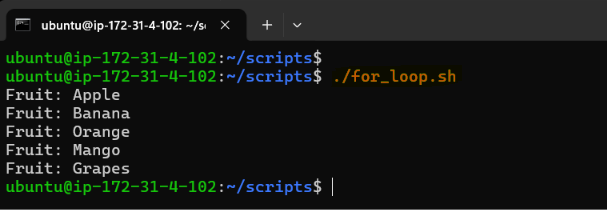
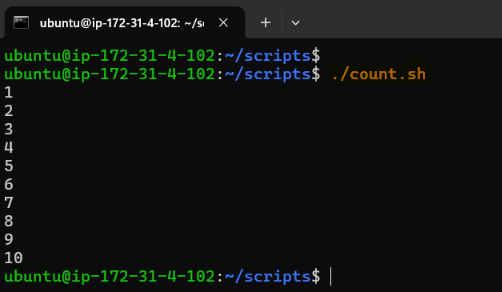
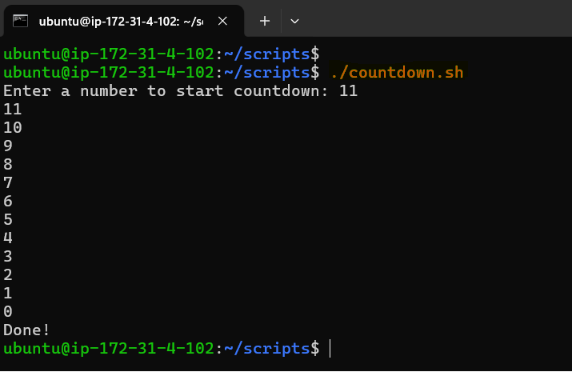
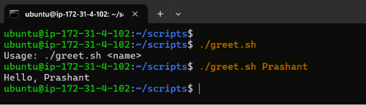
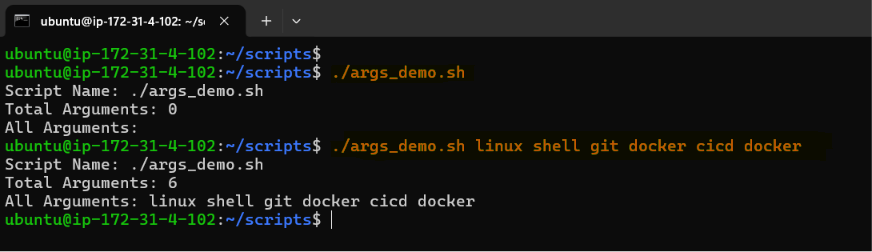
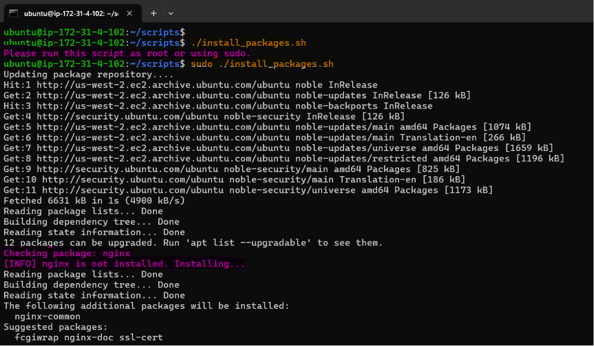
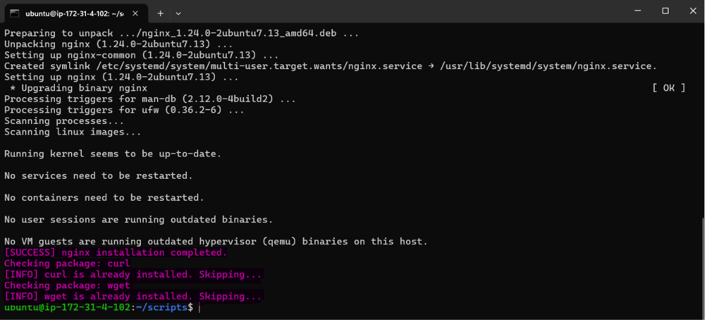
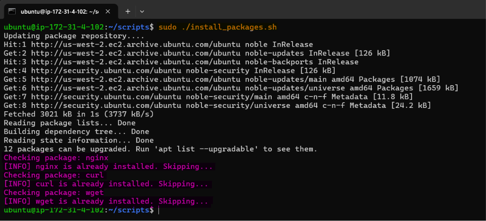
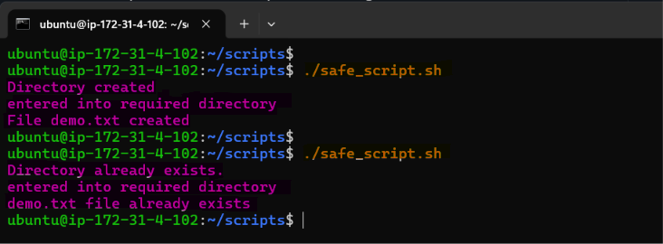
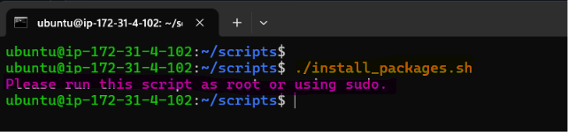

# Day 17 – Shell Scripting: Loops, Arguments & Error Handling

## Learning Objective:

Develop practical Bash scripting skills by learning how to automate repetitive tasks using loops, accept user input through command-line arguments, perform conditional package installation, and build resilient scripts with basic error handling techniques commonly used in DevOps and Platform Engineering environments.

---

## Task 1: For Loop

1. Create `for_loop.sh` that:
    - Loops through a list of 5 fruits and prints each one

[**Script:** for_loop.sh](scripts/for_loop.sh)

**Output:**



2. Create `count.sh` that:
    - Prints numbers 1 to 10 using a for loop

[**Script:** count.sh](scripts/count.sh)

**Output:**



**Observation:**

- The `for` loop executes a block of code repeatedly for each item in a list or range.
- It is useful for automating repetitive tasks such as processing files, restarting services, or iterating through multiple servers.
- In `for_loop.sh`, the loop iterated through a predefined list of fruits and printed each item sequentially.
- In `count.sh`, the loop used a numeric range (`{1..10}`) to print numbers from 1 to 10.
- **Syntax learned:**

```bash
for item in list;
do
    # commands
done
```

- **Key Observation:** A `for` loop is best suited when the number of iterations or items is known in advance.

--- 

## Task 2: While Loop

1. Create `countdown.sh` that:
    - Takes a number from the user
    - Counts down to 0 using a while loop
    - Prints "Done!" at the end

[**Script:** countdown.sh](scripts/countdown.sh)

**Output:**



**Observation:**

- A `while` loop executes repeatedly as long as a specified condition evaluates to true.
- Unlike a `for` loop, it is condition-based rather than list-based.
- The script accepted user input and continued counting down until the value reached zero.
- This type of loop is commonly used in DevOps for retry mechanisms, polling services, health checks, and waiting for resources to become available.
- **Syntax learned:**

```bash
while [ condition ];
do
    # commands
done
```

- **Key Observation:** A `while` loop is ideal when the number of iterations is unknown and depends on runtime conditions.

---

## Task 3: Command-Line Arguments

1. Create `greet.sh` that:
    - Accepts a name as `$1`
    - Prints `Hello, <name>!`
    - If no argument is passed, prints "Usage: ./greet.sh "

[**Script:** greet.sh](scripts/greet.sh)

**Output:**



2. Create `args_demo.sh` that:
    - Prints total number of arguments (`$#`)
    - Prints all arguments (`$@`)
    - Prints the script name (`$0`)

[**Script:** args_demo.sh](scripts/args_demo.sh)

**Output:**



**Observation:**

- Command-line arguments make Bash scripts reusable by allowing input values to be passed during execution instead of hardcoding them.
- The `greet.sh` script used `$1` to accept the first argument and displayed a usage message if no argument was provided.
- The `args_demo.sh` script demonstrated Bash positional parameters.
- **Important special variables learned:**
    - `$0` → Script name
    - `$1` → First argument
    - `$#` → Total number of arguments
    - `$@` → All arguments
- **Key Observation:** Command-line arguments improve script flexibility and are widely used in automation scripts, deployment scripts, and CI/CD pipelines.

---

## Task 4: Install Packages via Script

1. Create `install_packages.sh` that:
    - Defines a list of packages: `nginx`, `curl`, `wget`
    - Loops through the list
    - Checks if each package is installed (use `dpkg -s` or `rpm -q`)
    - Installs it if missing, skips if already present
    - Prints status for each package

> Run as root: `sudo -i` or `sudo su`

[**Script:** install_packages.sh](scripts/install_packages.sh)

**Output:**







**Observation:**

- The package installation script automated software installation instead of requiring manual intervention.
- A list of packages (`nginx`, `curl`, `wget`) was processed using a `for` loop.
- Before installing, the script checked whether each package was already installed using:

```bash
# For Debian based Linux system
dpkg -s <package> &> /dev/null 

# For Red Hat-based Linux system
rpm -q <package> &> /dev/null
```

- If the package was already installed, it was skipped; otherwise, it was installed.

---

## Task 5: Error Handling

1. Create `safe_script.sh` that:
    - Uses `set -e` at the top (exit on error)
    - Tries to create a directory `/tmp/devops-test`
    - Tries to navigate into it
    - Creates a file inside
    - Uses `||` operator to print an error if any step fails

Example:

```
mkdir /tmp/devops-test || echo "Directory already exists"
```

[**Script:** safe_script.sh](scripts/safe_script.sh)

**Output:** 



**Observation:**

- Error handling improves script reliability by preventing unexpected behavior after a command failure.
- The script used `set -e` to terminate execution immediately when an unhandled command failed.
- The `||` operator was used to gracefully handle expected failures, such as attempting to create a directory that already exists.
- The script successfully:
    - Created a directory.
    - Changed into the directory.
    - Created a file.
    - Displayed meaningful messages when expected errors occurred.
- **Important concepts learned:**

```bash
# Stops the script when an unhandled command fails
set -e

# Executes the second command only if the first command fails
command || echo "Error message"
```

- **Key Observation:** Combining `set -e` with explicit error handling (`||`) helps create robust automation scripts by failing fast on unexpected errors while gracefully managing anticipated conditions.

2. Modify your `install_packages.sh` to check if the script is being run as root — exit with a message if not.

**Output:**



**Observation:**

- A root privilege check using `$EUID` ensured the script was executed with administrative permissions before attempting package installation.
- **Important concepts learned:**
    - Root privilege validation:

```bash
if [ "$EUID" -ne 0 ]; then
    echo "Run as root"
    exit 1
fi
```

- **Key Observation:** Performing root checks and verifying package installation status makes scripts safer, idempotent, and suitable for production automation.

---

## Key Learnings:

- Understood how **for loops** simplify repetitive operations on lists and ranges.
- Learned to use **while loops** for condition-based iteration.
- Used **command-line arguments** ($0, $1, $#, $@) to build reusable scripts.
- Automated software installation by detecting installed packages and handling different package managers (dpkg and rpm).
- Implemented **root privilege checks** using the EUID variable to avoid permission-related failures.
- Improved script reliability with **set -e** and explicit error handling using the || operator.

---

## Takeaways:

Day 17 introduces the building blocks of production-ready Bash scripting. Loops reduce repetitive work, command-line arguments make scripts flexible, package installation logic supports automated server provisioning, and error handling ensures scripts fail safely instead of leaving systems in an inconsistent state. These patterns are widely used in DevOps automation, CI/CD pipelines, infrastructure provisioning, and configuration management, making them essential skills for any Platform or DevOps Engineer.