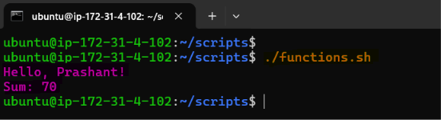
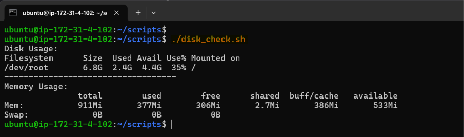
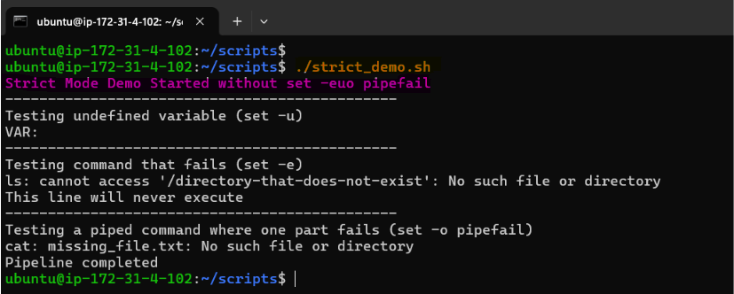
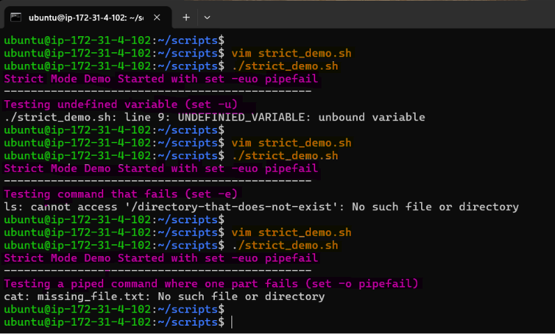
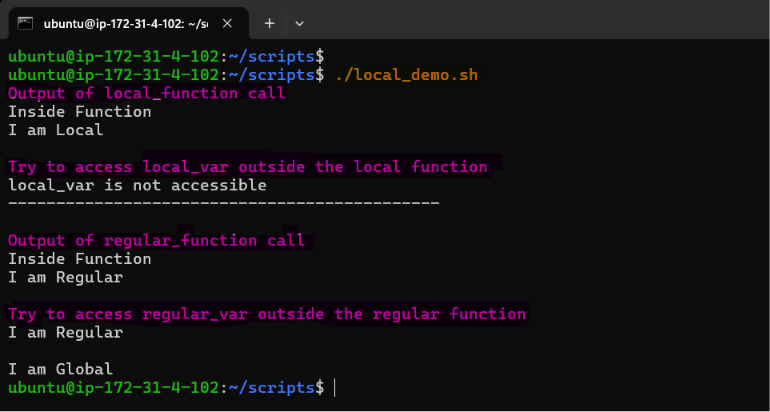
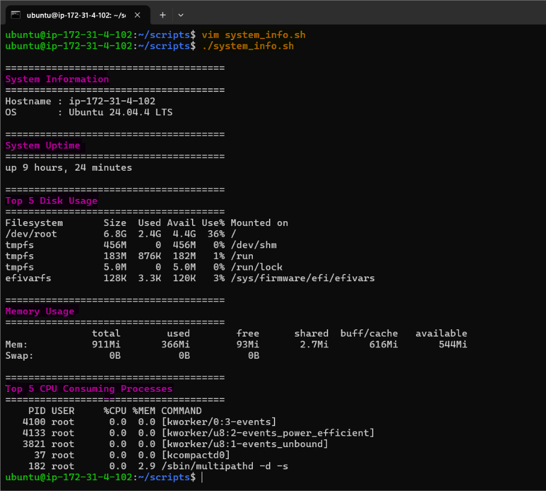

# Day 18 – Shell Scripting: Functions & intermediate Concepts

## Learning Objective:
Build production-ready Bash scripts by using **functions, local variables, and Bash strict mode (`set -euo pipefail`)** to create reusable, maintainable, and reliable automation scripts commonly used in DevOps, DevSecOps, and Platform Engineering.

--- 

## Task 1: Basic Functions

1. Create `functions.sh` with:
    - A function `greet` that takes a name as argument and prints `Hello, <name>!`
    - A function `add` that takes two numbers and prints their sum
    - Call both functions from the script

[**Script:** functions.sh](scripts/functions.sh)

**Output:**

**Observation:**

- Learned how to define functions using the syntax `function_name() { ... }`.
- Understood that functions help make scripts modular and reusable.
- Passed arguments to functions (e.g., `greet "Prashant"`) and accessed them using positional parameters like `$1` and `$2`.
- Used a function to perform arithmetic operations and display the result.
- Observed that breaking logic into functions improves script readability and maintainability.
- Recognized that functions are widely used in DevOps automation to avoid repetitive code.

---

## Task 2: Functions with Return Values

1. Create `disk_check.sh` with:
    - A function `check_disk` that checks disk usage of `/` using `df -h`
    - A function `check_memory` that checks free memory using `free -h`
    - A main section that calls both and prints the results

[**Script:** disk_check.sh](scripts/disk_check.sh)

**Output:**

**Observation:**

- Created separate functions for checking disk usage and memory usage.
- Used a `main()` function to organize the execution flow of the script.
- Observed that functions simplify repetitive system administration tasks.
- Learned that Bash commands return an exit status, which can be checked using the special variable `$?`.
- Understood that an exit code of `0` indicates success, while a non-zero value indicates an error.
- Improved script organization by separating functionality into reusable components.

---

## Task 3: Strict Mode — `set -euo pipefail`

1. Create `strict_demo.sh` with `set -euo pipefail` at the top
2. Try using an **undefined variable** — what happens with `set -u`?
3. Try a command that **fails** — what happens with `set -e`?
4. Try a **piped command** where one part fails — what happens with `set -o pipefail`?

**Document:** What does each flag do?

- `set -e` → Script exits immediately if any command fails
- `set -u` → Script exits when using an undefined variable
- `set -o pipefail` → Fails the entire pipeline if any command in the pipe fails

[**Script:** strict_demo.sh](scripts/strict_demo.sh)

**Output:**

Without `Set -euo pipefail`

With `Set -euo pipefail`

**Observation:**

- Added `set -euo pipefail` immediately after the shebang (`#!/bin/bash`) to enable Bash Strict Mode.
- Observed that `set -e` immediately terminates the script when a command fails.
- Observed that `set -u` stops script execution when an undefined variable is referenced.
- Observed that `set -o pipefail` detects failures anywhere in a pipeline, not just the last command.
- Learned that Strict Mode helps prevent hidden errors and improves script reliability.
- Understood that Bash Strict Mode is considered a best practice for production automation and CI/CD scripts.

---

## Task 4: Local Variables

1. Create `local_demo.sh` with:
    - A function that uses `local` keyword for variables
    - Show that `local` variables don't leak outside the function
    - Compare with a function that uses regular variables

[**Script:** local_demo.sh](scripts/local_demo.sh)

**Output:**

**Observation:**

- Used the `local` keyword (e.g., `local local_var="value"`) to restrict variable scope within a function.
- Observed that local variables are accessible only inside the function where they are declared.
- Verified that local variables do not affect variables outside the function.
- Compared the behavior of local variables with global variables that persist outside the function.
- Learned that using `local` prevents accidental modification of global variables and improves code maintainability.
- Understood that limiting variable scope is a recommended Bash scripting practice.

---

## Task 5: Build a Script — System Info Reporter

Create `system_info.sh` that uses functions for everything:

1. A function to print **hostname and OS info**
2. A function to print **uptime**
3. A function to print **disk usage** (top 5 by size)
4. A function to print **memory usage**
5. A function to print **top 5 CPU-consuming processes**
6. A `main` function that calls all of the above with section headers
7. Use `set -euo pipefail` at the top

Output should look clean and readable.
 
[**Script:** system_info.sh](scripts/system_info.sh)

**Output:**

**Observation:**

- Built a modular script by dividing each system information task into separate functions.
- Used a `main()` function to execute all reporting functions in a structured sequence.
- Applied `set -euo pipefail` to make the script more robust and fault-tolerant.
- Organized the output using section headers for better readability.
- Reused functions for collecting hostname, OS details, uptime, disk usage, memory usage, and CPU process information.
- Observed that combining functions, local variables, and Strict Mode results in cleaner, reusable, and production-ready Bash scripts suitable for DevOps and Platform Engineering automation.

---

## Key Learnings:

- Learned how to create and invoke reusable Bash functions with parameters.
- Understood the difference between `echo` (output) and `return` (exit status).
- Understood how to pass arguments to functions using positional parameters (`$1`, `$2`, etc.).
- Practiced using `local` variables to enforce function scope and improve maintainability.
- Explored Bash strict mode (`set -euo pipefail`) and how it helps detect failures earlier.
- Built a practical **System Information Reporter** that demonstrates modular scripting and clean output formatting.
- Organized scripts using a clear `main()` function for better readability and maintainability.

---

## Takeaways:

Functions and strict mode are foundational practices for writing maintainable Bash automation. By combining modular design, proper variable scoping, and fail-fast error handling, you can produce scripts that are easier to test, debug, and integrate into CI/CD pipelines, infrastructure provisioning, and day-to-day platform operations.