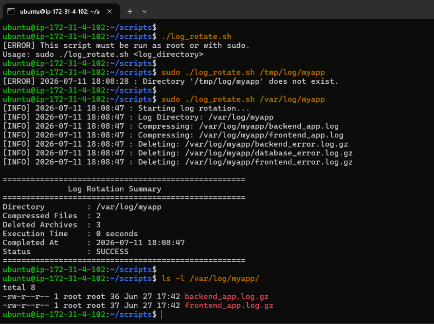
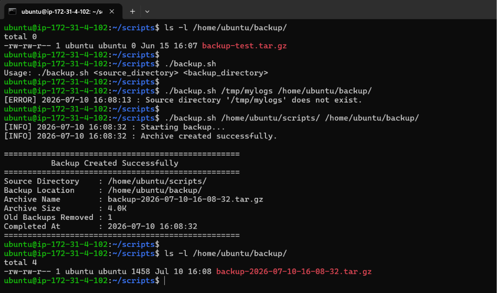
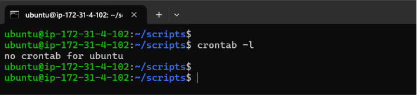
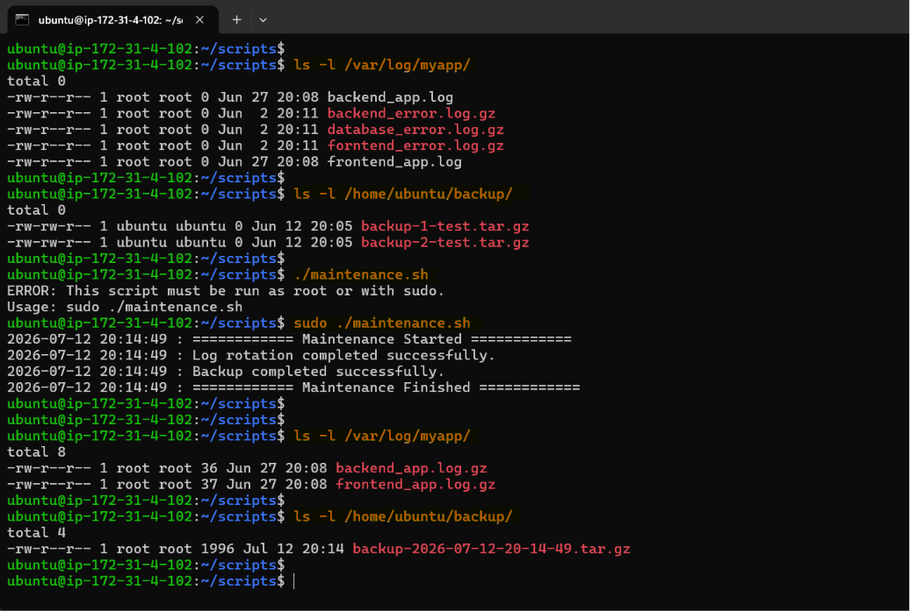
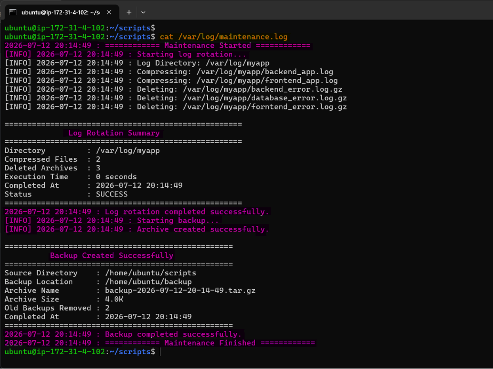

# Day 19 – Shell Scripting Project: Log Rotation, Backup & Crontab

## Learning Objective:

Build production-ready Linux automation scripts that perform **log rotation**, **server backups**, and **scheduled maintenance** using **Bash** and **Cron**, while implementing proper error handling, logging, cleanup, and automation best practices commonly used by DevOps, DevSecOps, and Platform Engineering teams.

---

## Task 1: Log Rotation Script

Create `log_rotate.sh` that:

1. Takes a log directory as an argument (e.g., `/var/log/myapp`)
2. Compresses `.log` files older than 7 days using `gzip`
3. Deletes `.gz` files older than 30 days
4. Prints how many files were compressed and deleted
5. Exits with an error if the directory doesn't exist

[**Script:** log_rotate.sh](scripts/log_rotate.sh)

**Output:** 



**Observation:**

- Verified that the script accepts the log directory as a command-line argument and exits with an appropriate error message if the directory does not exist.
- Used the `find` command with `mtime +7` to identify log files older than seven days, confirming that file modification time (`mtime`) is used to determine file age.
- Successfully compressed old `.log` files using `gzip`, which reduced disk space usage while preserving the log data in compressed format (`.gz`).
- Confirmed that compressed log files (`.gz`) older than 30 days were automatically deleted using the `find` command with the `-delete` option, implementing a simple log retention policy.
- Observed that after compression, the original `.log` files were replaced by `.log.gz` files because `gzip` removes the original file by default.
- Verified that the script accurately counted and displayed the number of files compressed and deleted.
- Learned that running the script on directories such as `/var/log` requires elevated privileges (`sudo`) because normal users do not have write permission to system log directories.

---

## Task 2: Server Backup Script

Create `backup.sh` that:

1. Takes a source directory and backup destination as arguments
2. Creates a timestamped `.tar.gz` archive (e.g., `backup-2026-02-08.tar.gz`)
3. Verifies the archive was created successfully
4. Prints archive name and size
5. Deletes backups older than 14 days from the destination
6. Handles errors — exit if source doesn't exist

[**Script:** backup.sh](scripts/backup.sh)

**Output:** 



**Observation:**

- Verified that the script validates the existence of the source directory before creating a backup.
- Used the `date` command (`date +%Y-%m-%d`) to generate timestamped backup filenames, ensuring each backup has a unique and identifiable name.
- Successfully created compressed archives using the `tar -czf` command, where:
    - `c` creates a new archive.
    - `z` compresses the archive using gzip.
    - `f` specifies the output archive filename.
- Confirmed that the script checks the exit status (`$?`) of the `tar` command to verify successful archive creation.
- Used `basename` to display only the archive filename, making the output cleaner and easier to read.
- Displayed archive size using `du -h`, allowing quick verification of backup size.
- Automatically removed backup archives older than 14 days using the `find` command with `mtime +14`, preventing unnecessary disk space consumption.
- Observed that creating the backup destination with `mkdir -p` avoids failures when the destination directory does not already exist.

---

## Task 3: Crontab

1. Read: `crontab -l` — what's currently scheduled?



2. Understand cron syntax:

```bash
* * * * *  command
│ │ │ │ │
│ │ │ │ └── Day of week (0-7)
│ │ │ └──── Month (1-12)
│ │ └────── Day of month (1-31)
│ └──────── Hour (0-23)
└────────── Minute (0-59)
```

3. Write cron entries (in your markdown, don't apply if unsure) for:
    - Run `log_rotate.sh` every day at 2 AM
    
    ```bash
    # Run Log Rotation Daily at 2 AM
    0 2 * * * /home/ubuntu/scripts/log_rotate.sh /tmp/log/myapp
    ```
    
    - Run `backup.sh` every Sunday at 3 AM
    
    ```bash
    # Run Backup Every Sunday at 3 AM
    0 3 * * 0 /home/ubuntu/scripts/backup.sh /home/ubuntu/backup
    ```
    
    - Run a health check script every 5 minutes
    
    ```bash
    # Health Check Every 5 Minutes
    */5 * * * * /home/ubuntu/scripts/health_check.sh
    ```
    
**Observation:**

- Verified existing scheduled jobs using `crontab -l` before creating new entries.
- Learned the five fields of a cron expression:
    - Minute
    - Hour
    - Day of Month
    - Month
    - Day of Week
- Used `crontab -e` to edit user-specific scheduled tasks.
- Understood that cron executes commands automatically at the specified schedule without manual intervention.
- Observed that cron runs with a minimal environment, making it important to use absolute paths for scripts and commands.
- Prepared cron schedules for:
    - Daily log rotation at 2:00 AM.
    - Weekly server backup every Sunday at 3:00 AM.
    - Health check execution every five minutes.
- Learned that testing scripts manually before scheduling them is a recommended practice to avoid repeated failures from cron jobs.

---

## Task 4: Combine — Scheduled Maintenance Script

Create `maintenance.sh` that:

1. Calls your log rotation function
2. Calls your backup function
3. Logs all output to `/var/log/maintenance.log` with timestamps
4. Write the cron entry to run it daily at 1 AM

[**Script:** maintenance.sh](scripts/maintenance.sh)

```
                 Cron Scheduler
                        │
                        │       
                        │                               
            maintenance.sh (1 AM Daily)           
        ┌───────────────┴───────────────┐
        │                               │
        │                               │
        │                               │
        ▼                               ▼
   log_rotate.sh                    backup.sh
        │                               │
        ▼                               ▼
   Compress Logs                   Create Archive
  Delete Old Logs                 Delete Old Backups
        │                               │
        └-------------------------------┘
                        │
                        ▼
            /var/log/maintenance.log
```

**Output:** 





```bash
0 1 * * * /home/ubuntu/scripts/maintenance.sh
```

**Observation:**

- Successfully combined the log rotation and backup scripts into a single maintenance script, demonstrating orchestration of multiple administrative tasks.
- Used a reusable logging function to record execution details with timestamps, improving traceability and simplifying troubleshooting.
- Redirected both standard output (`stdout`) and standard error (`stderr`) to a common log file using: `>> "$LOG_FILE" 2>&1` ensuring both successful messages and errors are captured.
- Learned the importance of using variable expansion correctly (`"$LOG_FILE"` instead of `"LOG_FILE"`). Incorrect quoting without `$` resulted in the creation of a file literally named `LOG_FILE`, highlighting how Bash processes redirection targets before executing commands.
- Observed that writing to `/var/log/maintenance.log` requires root privileges because `/var/log` is protected for system logging.
- Added a root privilege check using `$EUID` to prevent unauthorized execution and avoid permission-related failures.
- Used `set -euo pipefail` to improve script reliability by exiting on command failures, undefined variables, and pipeline errors.
- Prepared a cron entry to execute the maintenance script daily at **1:00 AM**, enabling fully automated server maintenance.
- Learned that a wrapper (or orchestrator) script simplifies automation by managing multiple tasks through a single scheduled job while maintaining centralized logging and easier maintenance.

---

## DevOps & DevSecOps Best Practices Applied:

- **Fail Fast:** `set -euo pipefail` stops execution on errors, undefined variables, or failed pipelines.
- **Input Validation:** Scripts verify required arguments and directory existence before proceeding.
- **Modular Design:** `maintenance.sh` reuses `log_rotate.sh` and `backup.sh` instead of duplicating logic.
- **Timestamped Logging:** Maintenance operations are logged with timestamps for auditability.
- **Automatic Cleanup:** Retention policies prevent excessive disk usage by removing outdated logs and backups.
- **Cron-Friendly Scripts:** Non-interactive execution with clear exit codes supports reliable scheduling.
- **Portable Paths:** `SCRIPT_DIR` ensures helper scripts are called correctly regardless of the current working directory.
- **Least Privilege:** Run scripts with the minimum permissions necessary, using sudo only when access to protected directories (such as `/var/log`) is required.
- **Security Consideration:** Quote all variables to avoid issues with spaces and reduce the risk of unintended shell expansion.

---

## Key Learnings:

- Gained practical experience in automating repetitive Linux administration tasks using Bash scripting.
- Learned how `find`, `gzip`, `tar`, `date`, and `cron` work together to implement automated server maintenance.
- Understood the importance of validation, error handling, logging, and retention policies in production-grade automation.
- Improved understanding of Linux file permissions, particularly when working with protected directories such as `/var/log`.
- Recognized the value of modular scripting by combining independent scripts into a single orchestrated maintenance workflow.
- Developed a deeper understanding of how Bash interprets variables, command substitution, exit codes, and redirection, which are fundamental skills for DevOps and Platform Engineering.
- Appreciated that production automation is not only about completing tasks but also about ensuring reliability, observability, maintainability, and recoverability through proper logging, validation, and scheduled execution.

---

## Takeaways:

Day 19 brings together everything learned in the previous scripting days into a practical automation project. By building reusable Bash scripts, scheduling them with Cron, and adding logging and retention policies, you've created a small but realistic maintenance framework similar to what Linux administrators, DevOps engineers, and Site Reliability Engineers use to keep production systems healthy, backed up, and operational with minimal manual effort.