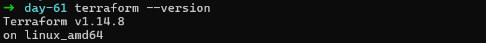
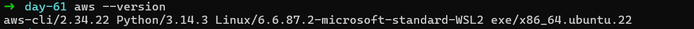
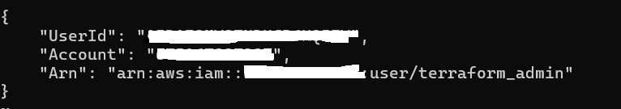
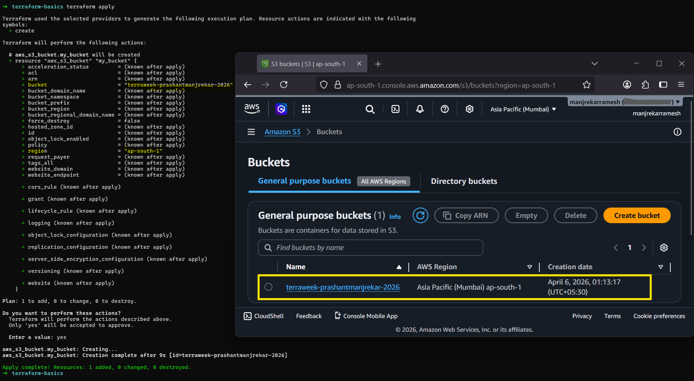
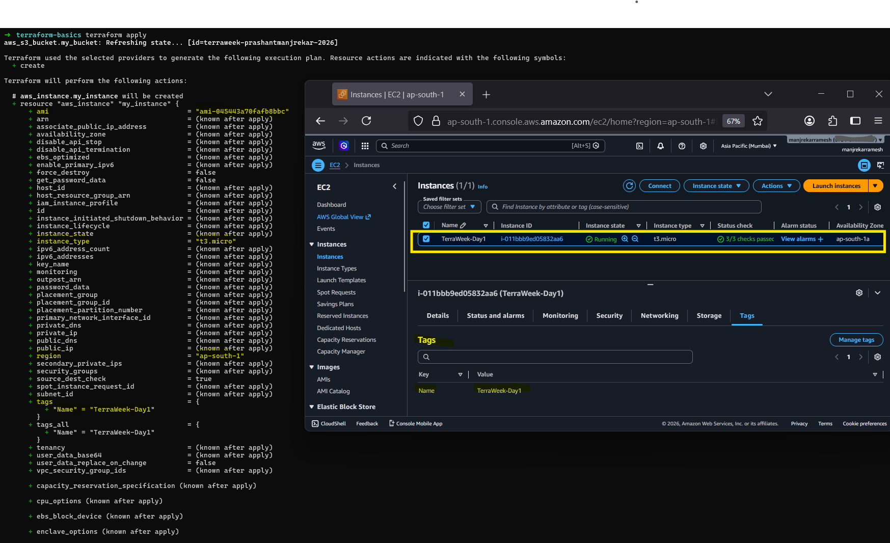
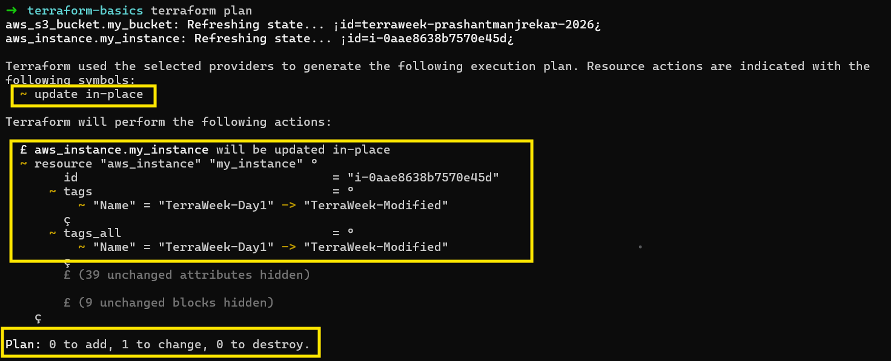
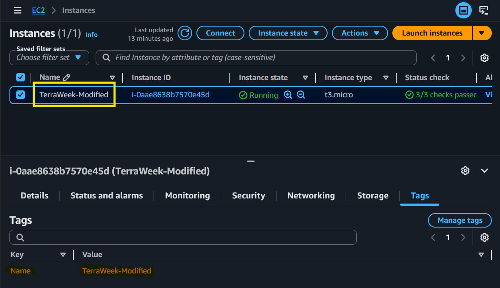
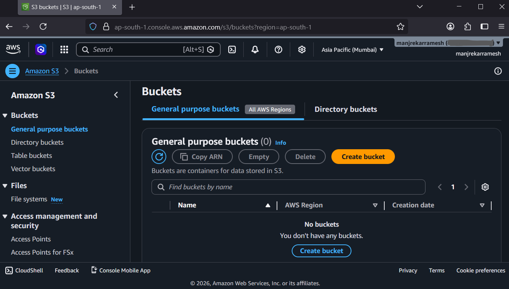
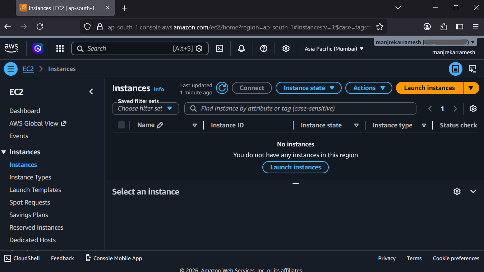

# Day 61 -- Introduction to Terraform and Your First AWS Infrastructure

## Overview

Today marked the beginning of my Infrastructure as Code (IaC) journey with Terraform. Instead of clicking around in the AWS console, I defined, provisioned, and destroyed real AWS resources — an S3 bucket and an EC2 instance — using nothing but .tf files and a terminal.

## Challenge Tasks

### Task 1: Understanding Infrastructure as Code (IaC)

#### 1. What is Infrastructure as Code (IaC)? Why does it matter in DevOps?

—> Infrastructure as Code (IaC) is the practice of managing and provisioning infrastructure (like servers, networks, and databases, etc.) using code instead of manual .

—> Instead of clicking around the cloud dashboards or manually configuring servers, you write configuration files that describe your desired infrastructure, and tools automatically create and manage it.

—> IaC is a core DevOps practice and it matters because it:
- Ensures consistency across environments
- Reduces human errors
- Enables automation
- Speeds up infrastructure provisioning
- Allows version control (track and revert changes easily) 


#### 2.  What problems does IaC solve compared to manually creating resources in the AWS console?

—> When you create resources manually through the AWS console, facing problems as 

- Time-consuming – You click through many screens for each resource.
- Human errors – Easy to miss configurations or make mistakes.
- Inconsistent environments – Dev, test, and prod may differ slightly.
- No version control – Hard to track who changed what and roll back.
- Difficult to scale – Recreating environments manually is slow and painful.
- Configuration drift – Over time, setups becomes inconsistent due to manual changes.

—> IaC solves this by making infrastructure:

- Automation – Infrastructure is created in minutes using code, no manual steps.
- Consistency - Same code means same identical environments every time.
- Version Control and Rollback – You can track changes and revert easily.
- Scalability – Easily replicate or expand infrastructure across regions.
- Reduced Errors – Eliminates most human mistakes.
- Drift Detection – Ensures actual infrastructure matches desired state.

#### 3. How is Terraform different from AWS CloudFormation, Ansible, and Pulumi?

—> Terraform vs AWS CloudFormation:

- Terraform works with multiple cloud providers (AWS, Azure, GCP) where as CloudFormation works only with AWS.
- Terraform uses its own language i.e. HCL (HashiCorp Configuration Language) where as CloudFormation uses JSON/YAML templates.

—> Terraform vs Ansible:

- Terraform used for provisioning infrastructure (create servers, networks, databases).
- Ansible used for configuration management (install software, update servers).

—> Terraform vs Pulumi:

- Terraform uses HCL custom language where as Pulumi uses real programming languages like Python, JavaScript, Go.
- Terraform is simpler to start with where as Pulumi is more flexible and developer-friendly supports full coding features.

—> Inshort:

| Tool | Main Use | Key Strength | Language |
| --- | --- | --- | --- |
| Terraform | Infrastructure provision | Multi cloud (AWS, Azure, GCP) | HCL  |
| AWS Cloud Formation | AWS infrastructure | AWS only, deep AWS integration | JSON/YAML templates |
| Ansible | Configure servers | Simple automation, agentless | YAML |
| Pulumi | IaC with real code | Flexibility, developer-friendly | Real programming  languages |

#### 4. What does it mean that Terraform is "declarative" and "cloud-agnostic"?

—> Terraform Declarative means:

- In Terraform, you define the desired end state of infrastructure rather than the steps to achieve it.
- Terraform automatically determines how to create, update, or delete resources to match that state.
- This simplifies infrastructure management and reduces manual errors.

—> Cloud-Agnostic means:

- Terraform works across multiple cloud platforms like Amazon Web Services, Microsoft Azure, and Google Cloud Platform.
- It uses providers to interact with different services.
- This allows users to manage multi-cloud or hybrid environments using a single tool and consistent workflow.
---

### Task 2: Install Terraform and Configure AWS
1. Installed Terraform (Linux/Ubuntu):

```bash
# Linux (amd64)
wget -O - https://apt.releases.hashicorp.com/gpg | sudo gpg --dearmor -o /usr/share/keyrings/hashicorp-archive-keyring.gpg
echo "deb [signed-by=/usr/share/keyrings/hashicorp-archive-keyring.gpg] https://apt.releases.hashicorp.com $(lsb_release -cs) main" | sudo tee /etc/apt/sources.list.d/hashicorp.list
sudo apt update && sudo apt install terraform
```

2. Verified the installation:



3. Installed and configured the AWS CLI:



4. Verified AWS access:



---

### Task 3: Your First Terraform Config -- Create an S3 Bucket
Create a project directory and write your first Terraform config:

```bash
mkdir terraform-basics && cd terraform-basics
```

Create a file called `main.tf` with:
1. A `terraform` block with `required_providers` specifying the `aws` provider
2. A `provider "aws"` block with your region
3. A `resource "aws_s3_bucket"` that creates a bucket with a globally unique name

Run the Terraform lifecycle:
```bash
terraform init      # Download the AWS provider
terraform plan      # Preview what will be created
terraform apply     # Create the bucket (type 'yes' to confirm)
```

Verified that bucket exists on AWS S3 console:



#### What did `terraform init` download? What does the `.terraform/` directory contain?

—> When we run `terraform init` , Terraform prepares our working directory by downloading necessary dependencies and setting up the local environment required for planning and applying infrastructure changes.

—> `terraform init` downloads:

- **Provider Plugins:** Binary executables (e.g., terraform-provider-aws) that allow Terraform to communicate with cloud with cloud APIs. These are typically fetched from the Terraform Registry.
- **Module Sources:** If our configuration references remote modules (from GitHub, or the Terraform Registry), Terraform downloads them and caches them locally.
- **Backend Configuration:** It initializes the backend (e.g., S3 Bucket, Terraform Cloud, or local) used to store your state file.

—> The hidden  `.terraform/`  directory is automatically managed and contains the following:

- **providers/ :** A hierarchical cache containing downloaded provider binaries, organized by hostname, namespace, and version. (e.g., .terraform/providers/registry.terraform.io/hashicorp/aws/6.39.0)
- **modules/ :** Contains local copies of any remote modules used in the configuration. It also includes a module.json  file that maps module names to their local directory paths.
- **terraform.tfstate :** A local file that stores the most recent backend configuration (including any credentials or workspace settings), which is distinct from the primary sate file that tracks our actual infrastructure.

---

### Task 4: Add an EC2 Instance
In the same `main.tf`, add:
1. A `resource "aws_instance"` using AMI `ami-0f5ee92e2d63afc18` (Amazon Linux 2 in ap-south-1 -- use the correct AMI for your region)
2. Set instance type to `t2.micro`
3. Add a tag: `Name = "TerraWeek-Day1"`

Run:
```bash
terraform plan      # You should see 1 resource to add (bucket already exists)
terraform apply
```

Verified that instance running with tag TerraWeek-Day1 in the EC2 console:



#### How does Terraform know the S3 bucket already exists and only the EC2 instance needs to be created?

—> Terraform knows the S3 bucket exists because it reads the `terraform.tfstate` file before planning.

 —> It compares the desired state (what's in `.tf` files) against the recorded state (what's in `.tfstate`). 

—> Since the S3 bucket is already recorded in the state file as created, Terraform knows it exists and only needs to create the EC2 instance.

---

### Task 5: Understand the State File
Terraform tracks everything it creates in a state file. Time to inspect it.

1. Open `terraform.tfstate` in your editor -- read the JSON structure
2. Run these commands and document what each returns:
```bash
terraform show                          # Human-readable view of current state
terraform state list                    # List all resources Terraform manages
terraform state show aws_s3_bucket.<name>   # Detailed view of a specific resource
terraform state show aws_instance.<name>
```

`terraform show`

—> Output shows full Terraform current state in a human-readable format.

—> It displayed detailed information about all managed resources, including:
- EC2 instance (ID, state, IPs, tags, etc.)
- S3 bucket (name, ARN, region, configuration)

`terraform state list`

—> Lists all resources tracked in the Terraform state

—> Output shows: aws_instance.my_instance and aws_s3_bucket.my_bucket

—> This confirms Terraform is managing both resources.

`terraform state show aws_s3_bucket.my_bucket`

—> Displays detailed state information for the S3 bucket only, such as:
- Bucket name and ARN
- Region
- Encryption Settings
- Versioning Configuration

`terraform state show aws_instance.my_instance`

—> Displays detailed state information for the EC2 instance, including:
- Instance ID and State (running)
- Instance type
- Public & Private IPs
- Subnet and Security Groups
- Tags (Name = TerraWeek-Day1)

#### What information does the state file store about each resource?
—> The `terraform.tfstate` file stores the full JSON representation of every resource Terraform manages — resource type, unique IDs (like instance_id, bucket ARN), all attributes (IP addresses, availability zones, tags), current state, provider metadata, and dependencies, allowing Terraform to map configuration to real infrastructure and track changes.

#### Why should you never manually edit the state file?
—> The state file is the source of truth Terraform uses to calculate diffs. If you edit it manually and introduce incorrect values, Terraform's next plan will produce wrong diffs between state and actual infrastructure — it might try to destroy real resources or attempt to create duplicates. 

—> The correct way to fix state issues is via `terraform state mv`, `terraform state rm`, or `terraform import` commands.

#### Why should the state file not be committed to Git?
—> We should not commit the Terraform state file (`terraform.tfstate`) to Git because it creates security risk and operational problems.

1. It contains sensitive data:
    - The state file can store passwords, API keys, private credentials and these are often stored in plain text.
    - If you push it to Git (especially public repos), anyone can access that data.
2. Risk of outdated (stale) state
    - Git is not real-time, we might forget to pull latest changes
    - Teammates may use old versions of the state file
    - Terraform could run against incorrect state → leading to wrong changes.
3. No locking → conflicts & overwrites
    - Git does not handle concurrent state updates well:
        - Two people run terraform apply at the same time
        - One state file can overwrite the other
    - This can corrupt state or break infrastructure.
4. Can break infrastructure
    - If the state in Git is wrong or outdated:
        - Terraform may try to recreate existing resources
        - Or delete working infrastructure
    - Because it trusts the state file as the source of truth
5. Not designed for version control
    - State files change frequently and large JSON snapshots so cause merge conflicts
    - Git is not meant for this kind of file

What you should do instead?
- Use a **remote backend** like AWS S3, Azure Storage, Google Cloud Storage
- These provide secure storage, automatic updates, and state locking.
---

### Task 6: Modify, Plan, and Destroy
1. Change the EC2 instance tag from `"TerraWeek-Day1"` to `"TerraWeek-Modified"` in your `main.tf`
2. Run `terraform plan` and read the output carefully:

#### - What do the `~`, `+`, and `-` symbols mean?

| Symbol | Meaning |
|--------|---------|
| `+` | Resource will be **created** |
| `-` | Resource will be **destroyed** |
| `~` | Resource will be **updated in-place** |
| `-/+` | Resource will be **destroyed and recreated** |

#### - Is this an in-place update or a destroy-and-recreate?

—> For a tag change, Terraform shows `~` — this is an **in-place update**. Tags are mutable attributes that AWS can change without recreating the instance. If we had changed the AMI or instance type, it would show `-/+` (destroy and recreate).



3. Apply the change

4. Verify the tag changed in the AWS console

Verified the tag changed to `TerraWeek-Modified` in the EC2 console.



5. Finally, destroy everything:
```bash
terraform destroy
```
6. Verify in the AWS console -- both the S3 bucket and EC2 instance should be gone

Verified that both the S3 bucket and EC2 instance are gone from the AWS console





---

#### What the state file contains and why it matters?

—> The state file is essentially a JSON document that stores:

1. Resource mappings
    - Maps each resource in your Terraform config to the actual resource in the cloud/provider.
    - Example: your aws_instance.my_server → specific EC2 instance ID.
2. Resource attributes
    - All known attributes of resources (IDs, IPs, metadata, etc.).
    - Includes both user-defined values and computed values from providers.
3. Dependency relationships
    - Tracks how resources depend on each other so Terraform can apply changes in the correct order.
4. Provider configuration metadata
    - Information about which provider (AWS, Azure, etc.) is managing each resource.
5. Outputs
    - Values defined in output blocks (e.g., public IPs, URLs).
6. Versioning info
    - Terraform version and state schema version.

—> The state file matters because:

1. Source of truth

   Terraform uses the state file as the authoritative record of what exists.
    - Without it, Terraform wouldn’t know what it created.

2. Efficient planning

   Instead of querying every resource every time:
    - Terraform compares desired config vs state file → generates execution plan quickly.

3. Change tracking

   Terraform determines:
    - What to create
    - What to update
    - What to delete
    by diffing config against the state.

4. Dependency resolution
 
   The state ensures resources are:
    - Created in the correct order
    - Destroyed safely

5. Collaboration (team environments)

   When stored remotely (e.g., S3 + locking):
    - Prevents conflicts
    - Enables multiple users to safely work on the same infrastructure

6. Disaster recovery

   If lost:
    - Terraform may try to recreate resources
    - Or lose track of existing infrastructure

#### What each Terraform command does (init, plan, apply, destroy, show, state list)

| Command | What it does |
|---|---|
| `terraform init` | Initializes the working directory, downloads provider plugins |
| `terraform plan` | Shows a preview of changes without making them — "dry run" |
| `terraform apply` | Executes the plan and provisions/modifies real infrastructure |
| `terraform destroy` | Destroys all resources managed by the current state |
| `terraform show` | Prints human-readable view of current state |
| `terraform state list` | Lists all resources tracked in the state file |
| `terraform state show <resource>` | Shows detailed attributes of a specific resource |
| `terraform fmt` | Auto-formats `.tf` files to canonical HCL style |
| `terraform validate` | Checks syntax and config validity without connecting to AWS

---

## References

- [Terraform Official Docs](https://developer.hashicorp.com/terraform/docs)
- [Terraform AWS Provider](https://registry.terraform.io/providers/hashicorp/aws/latest/docs)
